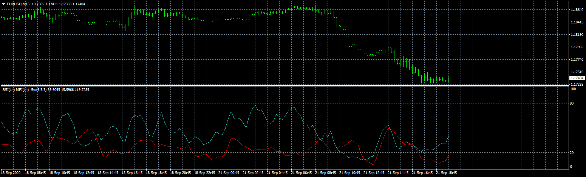

# MFI_RSI_ST

> Source: https://fxcodebase.com/code/viewtopic.php?f=38&t=70466  
> Forum: 38 · Topic 70466 · 4 post(s)

---

## MFI_RSI_ST

**Apprentice** · Mon Sep 21, 2020 11:57 am

Based on request.
[viewtopic.php?f=38&t=70460](https://fxcodebase.com/code/viewtopic.php?f=38&t=70460)

 [MFI_RSI_ST.mq4](files/137769/MFI_RSI_ST.mq4)

---

## Re: MFI_RSI_ST

**alienfriend18** · Mon Sep 21, 2020 12:15 pm

Signal lines disappear when we change timeframe or restart mt4 or change symbol

---

## Re: MFI_RSI_ST

**Apprentice** · Tue Sep 22, 2020 2:41 am

Your request is added to the development list.
Development reference 2078.

---

## Re: MFI_RSI_ST

**Apprentice** · Tue Sep 22, 2020 5:22 am

Fixed.
