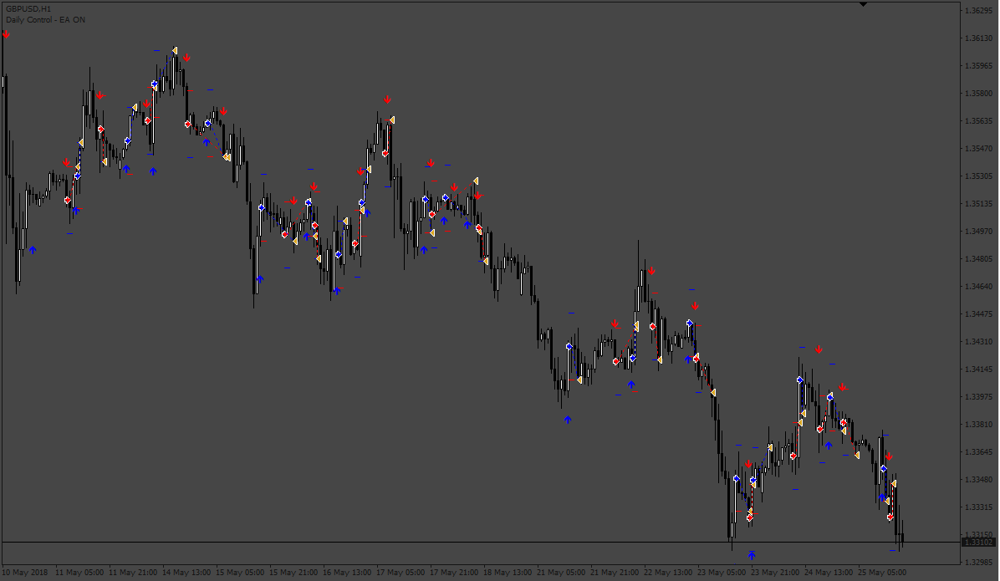
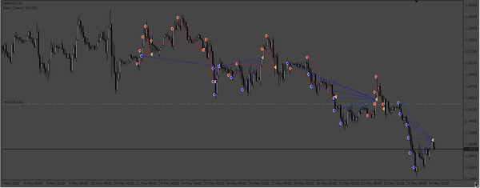

# MH Arrow Signals EA

> Source: https://fxcodebase.com/code/viewtopic.php?f=38&t=72657  
> Forum: 38 · Topic 72657 · 9 post(s)

---

## MH Arrow Signals EA

**Apprentice** · Wed Aug 24, 2022 3:29 am

Based on the request.
[https://fxcodebase.com/code/viewtopic.php?f=27&p=147135](https://fxcodebase.com/code/viewtopic.php?f=27&p=147135)

 [!--MH Arrow Signals.mq4](files/147211/--MH%20Arrow%20Signals.mq4)

 [MH Arrow Signals EA.mq4](files/147211/MH%20Arrow%20Signals%20EA.mq4)

---

## Re: MH Arrow Signals EA

**thiza3062** · Wed Oct 05, 2022 6:58 am

Hi guys the ea looks good
can you add a martingale feature

Thanks

---

## Re: MH Arrow Signals EA

**thiza3062** · Thu Oct 06, 2022 12:48 pm

Hi Apprentice and Team

can you kindly add the martingale feature to the ea

---

## Re: MH Arrow Signals EA

**Apprentice** · Thu Oct 06, 2022 2:13 pm

We have added your request to the development list.
Development reference 617.

---

## Re: MH Arrow Signals EA

**cirque73** · Fri Oct 07, 2022 1:41 am

LOL I just did this one. Here you go. May need a martingale....Let me know.

---

## Re: MH Arrow Signals EA

**cirque73** · Fri Oct 07, 2022 2:58 am

This one is with Martingale. It stops trading if your equity can't handle the next lot size.

---

## Re: MH Arrow Signals EA

**thiza3062** · Tue Oct 11, 2022 6:21 am

hi cirque73 both ea's does not take trades on demo and strategy tester

---

## Re: MH Arrow Signals EA

**Apprentice** · Tue Oct 18, 2022 1:31 am

 [MH_Arrow_Signals_EA with Martingale.mq4](files/147940/MH_Arrow_Signals_EA%20with%20Martingale.mq4)

---

## Re: MH Arrow Signals EA

**cirque73** · Fri Oct 28, 2022 9:06 pm

> **thiza3062 wrote:**
> hi cirque73 both ea's does not take trades on demo and strategy tester

Working fine on my end in demo.
