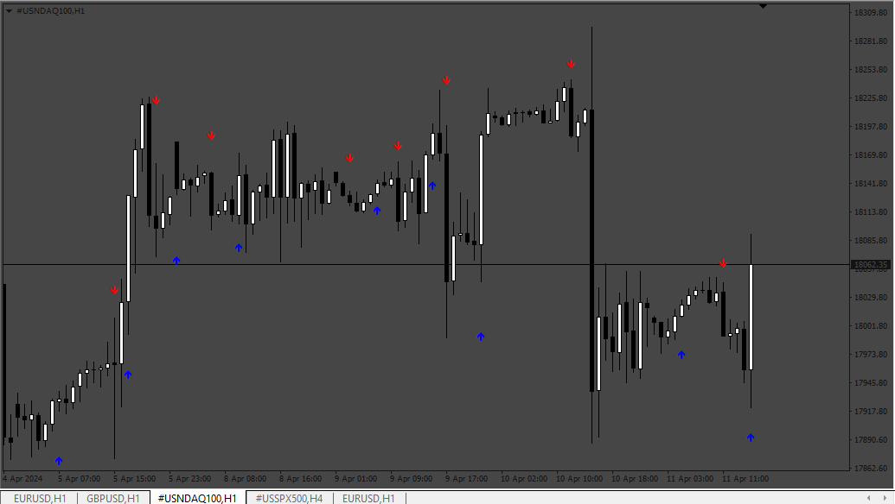
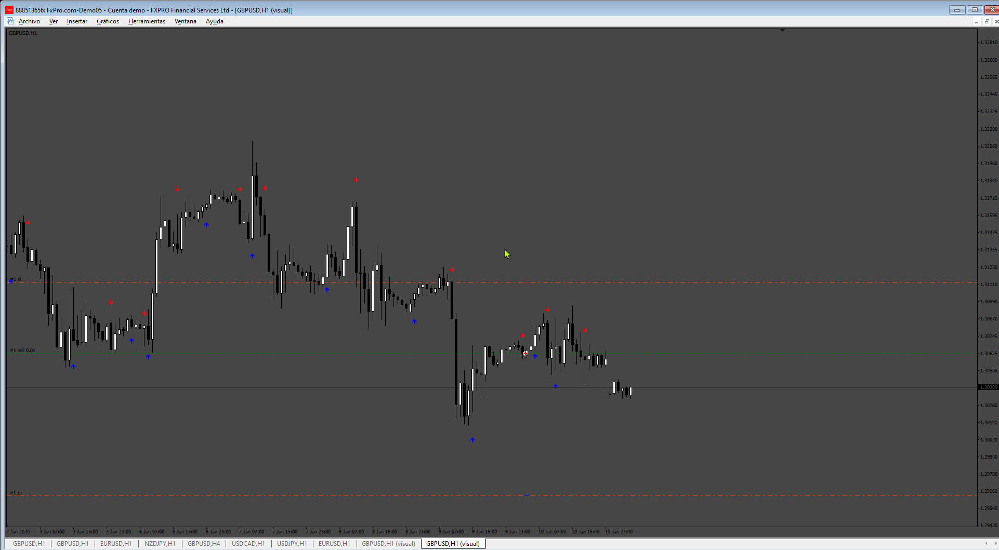
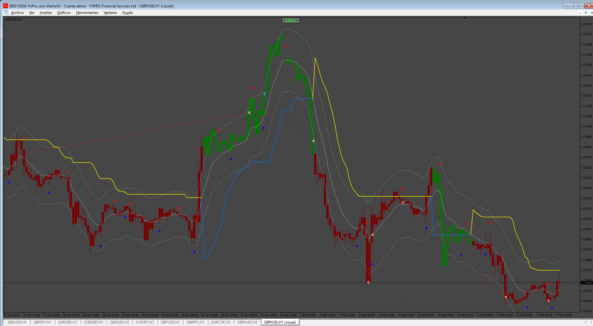

# MH_Arrows_Fresh_Code

> Source: https://fxcodebase.com/code/viewtopic.php?f=38&t=74785  
> Forum: 38 · Topic 74785 · 9 post(s)

---

## MH_Arrows_Fresh_Code

**Apprentice** · Tue Apr 16, 2024 4:44 am

Based on the request.
[https://fxcodebase.com/code/viewtopic.php?f=27&p=154902](https://fxcodebase.com/code/viewtopic.php?f=27&p=154902)
Not Multitimeframe

 [MH_Arrows_Fresh_Code.mq4](files/155038/MH_Arrows_Fresh_Code.mq4)

---

## Re: MH_Arrows_Fresh_Code

**gomezM** · Fri Sep 13, 2024 1:57 pm

Could you make an EA based on this indicator?
With the normal features, TP, sl, traling stop
thanks

---

## Re: MH_Arrows_Fresh_Code

**Apprentice** · Sat Sep 14, 2024 3:28 am

We have added your request to the development list.
Development reference 704

---

## Re: MH_Arrows_Fresh_Code

**Apprentice** · Wed Sep 18, 2024 3:44 pm

 [MH_Arrows_Fresh_Code.mq4](files/156736/MH_Arrows_Fresh_Code.mq4)

 [Arrow_fresh_EA.mq4](files/156736/Arrow_fresh_EA.mq4)

---

## Re: MH_Arrows_Fresh_Code

**trtrader** · Thu Sep 19, 2024 4:20 pm

same here please add this as a filter

---

## Re: MH_Arrows_Fresh_Code

**Apprentice** · Mon Sep 23, 2024 2:23 pm

Can you define the filter?

---

## Re: MH_Arrows_Fresh_Code

**trtrader** · Mon Sep 23, 2024 5:42 pm

When supertrend profit max green, only allow buy and when red, only allow sell

---

## Re: MH_Arrows_Fresh_Code

**Apprentice** · Tue Oct 01, 2024 5:50 am

We have added your request to the development list.
Development reference 755

---

## Re: MH_Arrows_Fresh_Code

**Apprentice** · Sun Oct 06, 2024 3:34 am

Try this version.

 [Arrow_fresh_EA_filter.mq4](files/156893/Arrow_fresh_EA_filter.mq4)
