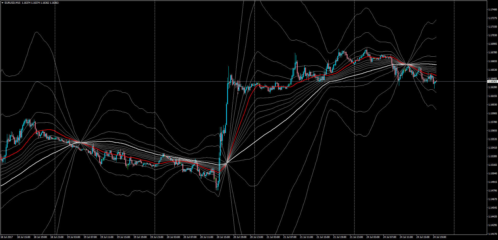

# MicroPivots

> Source: https://fxcodebase.com/code/viewtopic.php?f=38&t=64948  
> Forum: 38 · Topic 64948 · 1 post(s)

---

## MicroPivots

**Apprentice** · Tue Jul 25, 2017 8:32 am

LUA Original: [viewtopic.php?f=17&t=34751](https://fxcodebase.com/code/viewtopic.php?f=17&t=34751)

Description:

Indicator will show selected Fibonacci levels between two moving averages.

 [MicroPivots.mq4](files/113726/MicroPivots.mq4)
