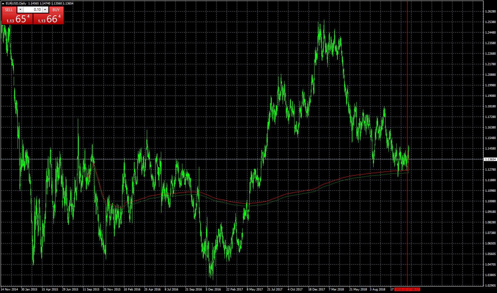

# MIDAS

> Source: https://fxcodebase.com/code/viewtopic.php?f=38&t=67188  
> Forum: 38 · Topic 67188 · 7 post(s)

---

## MIDAS

**Apprentice** · Sat Dec 22, 2018 8:44 am

Based on TS2/Lua version.
[viewtopic.php?f=17&t=19194](https://fxcodebase.com/code/viewtopic.php?f=17&t=19194)

 [MIDAS.mq4](files/122997/MIDAS.mq4)

---

## Re: MIDAS

**logicgate** · Sun Dec 23, 2018 6:29 am

Thanks so much my friend!

I haven't downloaded it yet, just wanted to ask if you added the MTF ability to it?

Cheers!

---

## Re: MIDAS

**Apprentice** · Tue Dec 25, 2018 5:50 am

Please re-download.
MTF ability is added.

---

## Re: MIDAS

**logicgate** · Tue Dec 25, 2018 8:05 am

> **Apprentice wrote:**
> Please re-download.
> MTF ability is added.

That is awesome!! Great xmas gift my friend! Hoping you are having a great day!

God Bless.

---

## Re: MIDAS

**logicgate** · Sun Aug 11, 2019 5:12 pm

Hi there my friend Apprentice.

Would like to know something about this indicator:

What data is it using on the volume input of the formula? Is it using the tick volume data or is it assuming a fixed value for all bars (1)?

Because I was reading the MIDAS book, and there is a part where he says that there is a "no volume" version of the MIDAS indicator, which sometimes are better suited for longer timeframes or when volume is not trending.

If it is using the same value for all bars, please change the code so it uses the volume data of each bar, if it is already doing that, please code the "no volume" version (where each bars has a volume value of 1).

Thanks

---

## Re: MIDAS

**Apprentice** · Tue Aug 13, 2019 4:56 am

In the FXCM case, Tick volume is used.
Will be broker specific.
Can you send the info to the mario(.)jemic(@)gmail(.)com

---

## Re: MIDAS

**logicgate** · Tue Aug 13, 2019 8:53 am

I have sent you the email.
