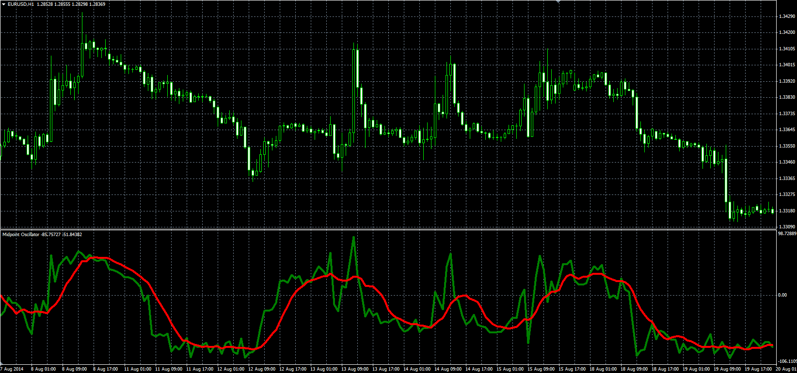

# Midpoint Oscillator

> Source: https://fxcodebase.com/code/viewtopic.php?f=38&t=61237  
> Forum: 38 · Topic 61237 · 1 post(s)

---

## Midpoint Oscillator

**Alexander.Gettinger** · Tue Sep 23, 2014 10:57 am

Original LUA oscillator: [viewtopic.php?f=17&t=27748](https://fxcodebase.com/code/viewtopic.php?f=17&t=27748).

Formulas:
M = 100*(2*Close-Max-Min)/(Max-Min),
S = MA(M) with [Smoothing_Length] number of periods and [Smoothing_Method] type, where
Min, Max - minimum and maximum values of price at range from (i-Length+1) to (i).

 

Download:

 [MPO.mq4](files/96138/MPO.mq4)
