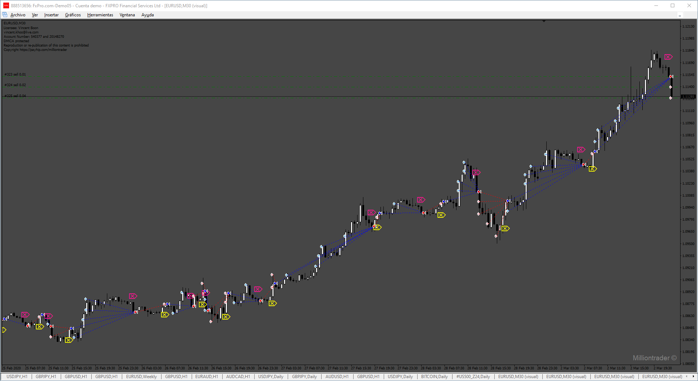

# MillonTrader_elite

> Source: https://fxcodebase.com/code/viewtopic.php?f=38&t=75358  
> Forum: 38 · Topic 75358 · 5 post(s)

---

## MillonTrader_elite

**Apprentice** · Sun Nov 17, 2024 4:44 am

Based on the request.
[https://fxcodebase.com/code/viewtopic.p ... 46#p156046](https://fxcodebase.com/code/viewtopic.php?f=27&p=156046#p156046)

 [MILLIONTRADE.ex4](files/157266/MILLIONTRADE.ex4)

 [MillonTrader_elite EA.mq4](files/157266/MillonTrader_elite%20EA.mq4)

---

## Re: MillonTrader_elite

**trigga** · Sun Nov 17, 2024 8:03 am

can you make this mt5

---

## Re: MillonTrader_elite

**mahi kahn** · Wed Nov 20, 2024 3:44 pm

> **Apprentice wrote:**
>
>
> 570.png
>
>
> Based on the request.
> [https://fxcodebase.com/code/viewtopic.p ... 46#p156046](https://fxcodebase.com/code/viewtopic.php?f=27&p=156046#p156046)
>
>
> MILLIONTRADE.ex4
>
>
>
>
> MillonTrader_elite EA.mq4

 MASTER , no adjust indicator value pleas add

---

## Re: MillonTrader_elite

**Apprentice** · Fri Nov 22, 2024 1:05 pm

We have added your request to the development list.
Development reference 859

---

## Re: MillonTrader_elite

**Apprentice** · Sun Nov 24, 2024 5:37 am

[42169](files/157341/859.png)

 [MillonTrader_elite_EA.mq4](files/157341/MillonTrader_elite_EA.mq4)
