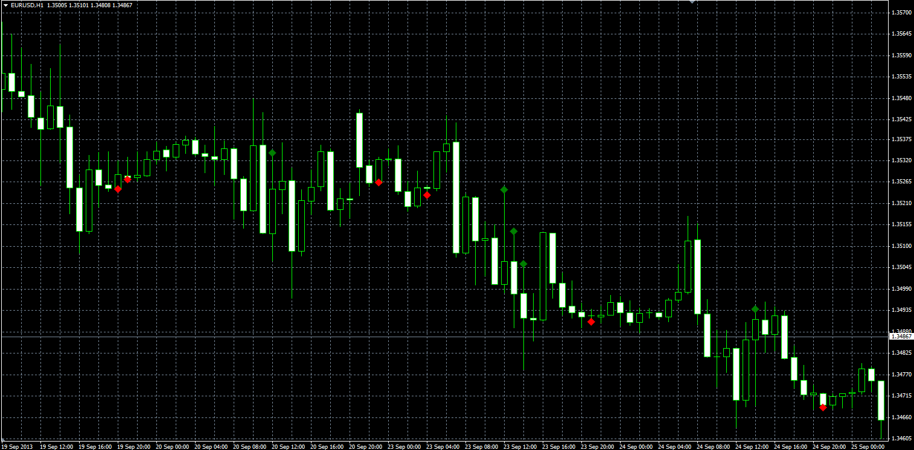
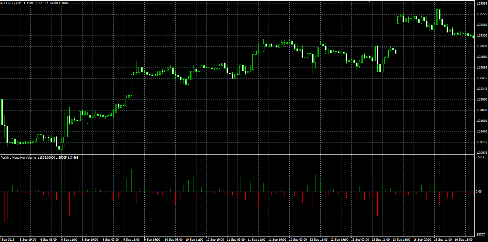

# Min Max Volume

> Source: https://fxcodebase.com/code/viewtopic.php?f=38&t=59590  
> Forum: 38 · Topic 59590 · 1 post(s)

---

## Min Max Volume

**Alexander.Gettinger** · Thu Sep 26, 2013 3:06 pm

Original LUA indicators: [viewtopic.php?f=17&t=59373&p=89073](https://fxcodebase.com/code/viewtopic.php?f=17&t=59373&p=89073).

**Min Max Volume:**

 

Download:

 [Min_Max_Volume.mq4](files/89725/Min_Max_Volume.mq4)

**Positive Negative Volume:**

 

Download:

 [Positive_Negative_Volume.mq4](files/89725/Positive_Negative_Volume.mq4)
