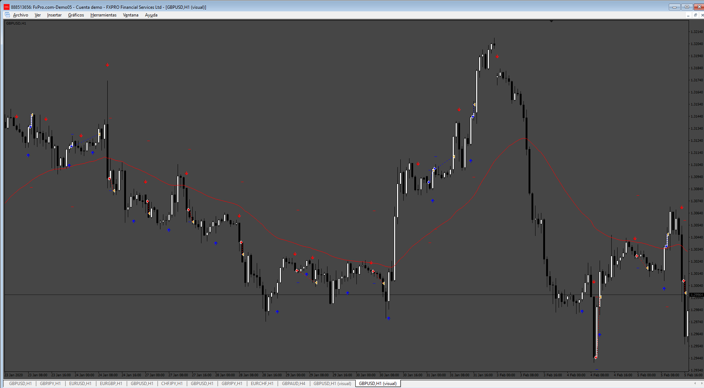

# Minhero_EA

> Source: https://fxcodebase.com/code/viewtopic.php?f=38&t=75263  
> Forum: 38 · Topic 75263 · 4 post(s)

---

## Minhero_EA

**Apprentice** · Sun Oct 06, 2024 3:26 am

Based on the request.
[https://fxcodebase.com/code/viewtopic.php?f=38&t=75245](https://fxcodebase.com/code/viewtopic.php?f=38&t=75245)

 [Mindhero.ex4](files/156890/Mindhero.ex4)

 [Minhero_EA.mq4](files/156890/Minhero_EA.mq4)

---

## Re: Minhero_EA

**trtrader** · Sun Oct 06, 2024 8:50 pm

In the attached EA, could you please

-- Delete mobo indicator
-- Add Minhero indicator as the main indicator for opening orders
-- All other EA options remains and works the same

---

## Re: Minhero_EA

**Apprentice** · Wed Oct 09, 2024 12:35 pm

We have added your request to the development list.
Development reference 778

---

## Re: Minhero_EA

**Apprentice** · Wed Apr 09, 2025 9:09 am

[Mindhero.ex4](files/158902/Mindhero.ex4)

 [Mobo_Bands_EA_v2.mq4](files/158902/Mobo_Bands_EA_v2.mq4)
