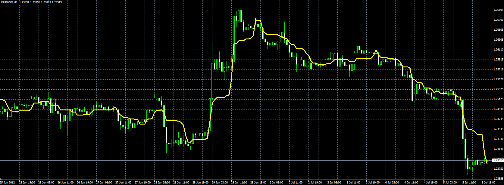

# MinMax moving average

> Source: https://fxcodebase.com/code/viewtopic.php?f=38&t=20878  
> Forum: 38 · Topic 20878 · 1 post(s)

---

## MinMax moving average

**Alexander.Gettinger** · Thu Jul 05, 2012 5:09 pm

Formula:
MinMaxMA[i]=(Min+Max)/2, where
Min, Max - minimum and maximum prices in range from (i-Period+1) to (i).

 

Download:

 [MinMax_MA.mq4](files/36567/MinMax_MA.mq4)
