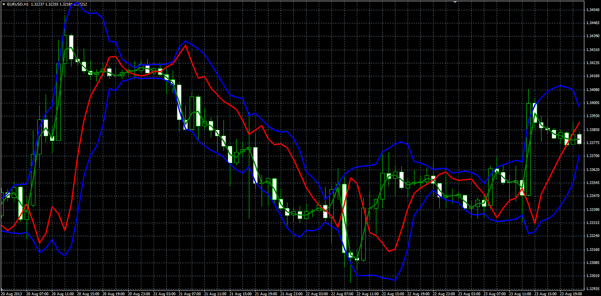

# Mirror Bands

> Source: https://fxcodebase.com/code/viewtopic.php?f=38&t=59346  
> Forum: 38 · Topic 59346 · 1 post(s)

---

## Mirror Bands

**Alexander.Gettinger** · Thu Aug 29, 2013 10:48 am

Original LUA indicator: [http://fxcodebase.com/code/viewtopic.php?f=17&t=59154](https://fxcodebase.com/code/viewtopic.php?f=17&t=59154).

Formulas:
Top[i] = Simple Moving average (Price, Length) + Dev,
Bottom[i] = Simple Moving average (Price, Length) - Dev,
MA[i] = Simple moving average (Price, MA_Length),
Mirror[i] = 2*Simple Moving average (Price, Length) - MA[i], where
Dev = Deviation*Sqrt(Sum/Length),
Sum - sum(Price[pos-i]-Simple Moving average (Price, Length)).

 

Download:

 [Mirror_Bands.mq4](files/89004/Mirror_Bands.mq4)
