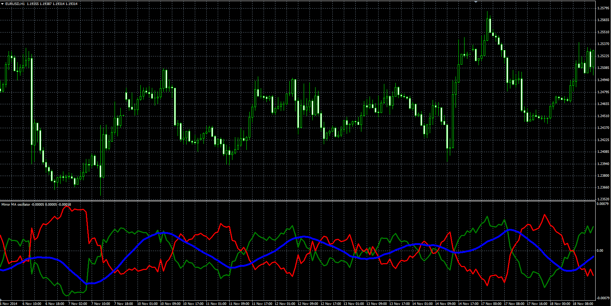

# Mirror MA indicator

> Source: https://fxcodebase.com/code/viewtopic.php?f=38&t=61671  
> Forum: 38 · Topic 61671 · 1 post(s)

---

## Mirror MA indicator

**Alexander.Gettinger** · Tue Jan 06, 2015 11:38 am

Formulas:
Line1 = MA1-MA2,
Line2 = MA2-MA1, where
MA1 - moving average with [Length1] number of periods and [Method1] type for [Price1] price,
MA2 - moving average with [Length2] number of periods and [Method2] type for [Price2] price.

 

Download:

 [Mirror_MA.mq4](files/98013/Mirror_MA.mq4)
