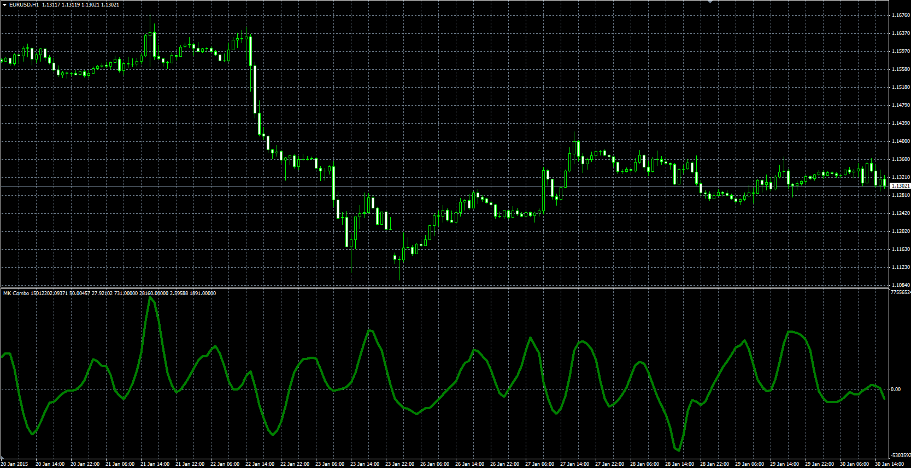

# MK combo

> Source: https://fxcodebase.com/code/viewtopic.php?f=38&t=61977  
> Forum: 38 · Topic 61977 · 1 post(s)

---

## MK combo

**Alexander.Gettinger** · Mon Mar 09, 2015 3:41 pm

Original LUA oscillator: [viewtopic.php?f=17&t=61566](https://fxcodebase.com/code/viewtopic.php?f=17&t=61566).

MK combo= MK combo + (SSD.K - SSD.D)*(TBS.K - TBS.D).

 

Download:

 [MK_Combo.mq4](files/99131/MK_Combo.mq4)
