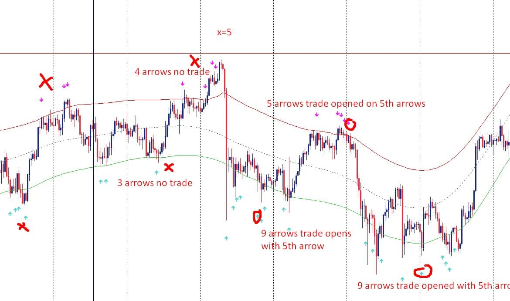
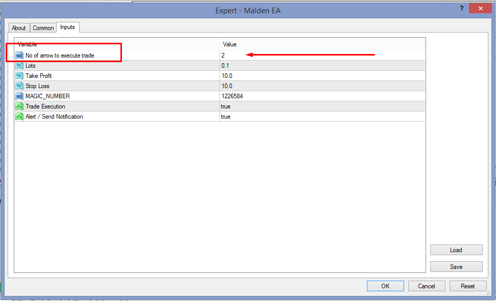

# Mladen_EA

> Source: https://fxcodebase.com/code/viewtopic.php?f=38&t=71633  
> Forum: 38 · Topic 71633 · 1 post(s)

---

## Mladen_EA

**Apprentice** · Tue Nov 09, 2021 2:43 am

Based on the request.
[https://fxcodebase.com/code/viewtopic.php?f=27&p=144156](https://fxcodebase.com/code/viewtopic.php?f=27&p=144156)

Due to repaint of indicator, trade executes as confirmation of repaint indicator, ( In Expert Property, there would be the option of "No of the arrow to execute trade" you can set to trade execute "How many times represent the arrow".

 

 [mladen_indicator.mq4](files/144212/mladen_indicator.mq4)

 [Mladen_EA.mq4](files/144212/Mladen_EA.mq4)
