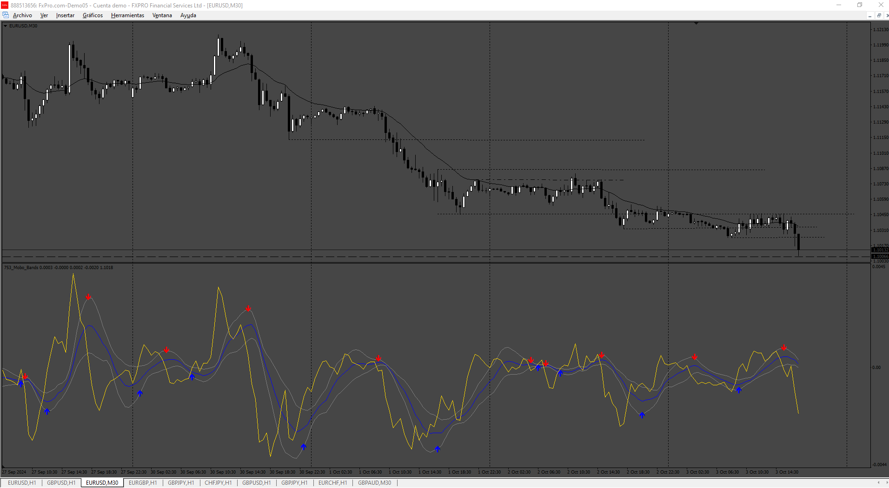
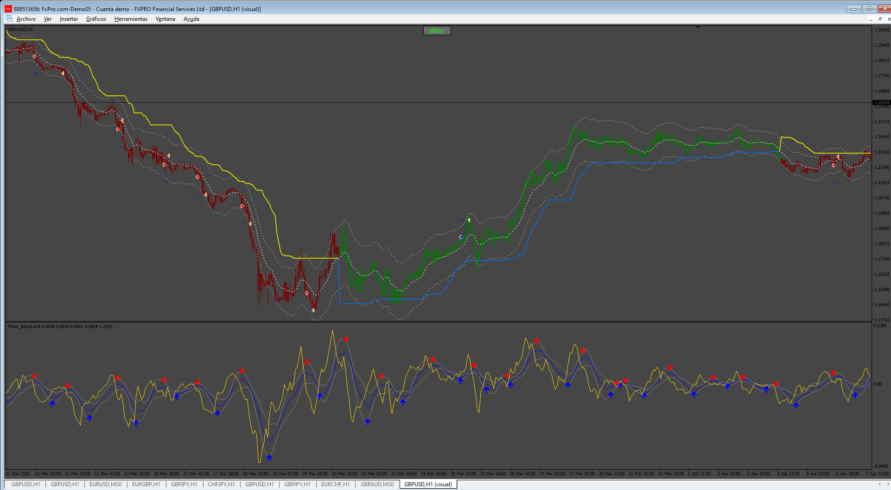
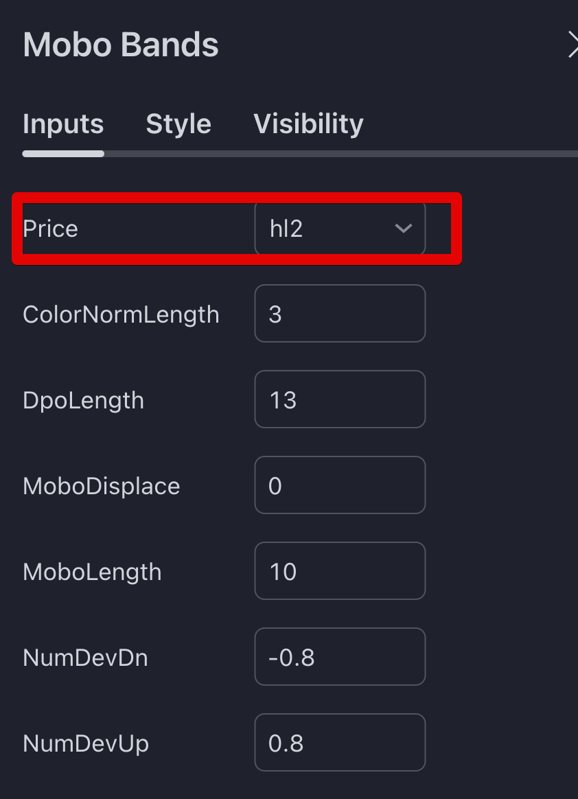
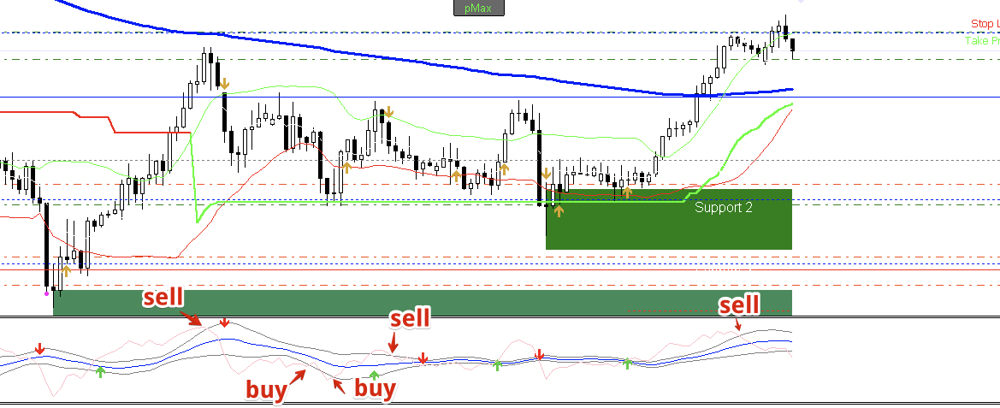
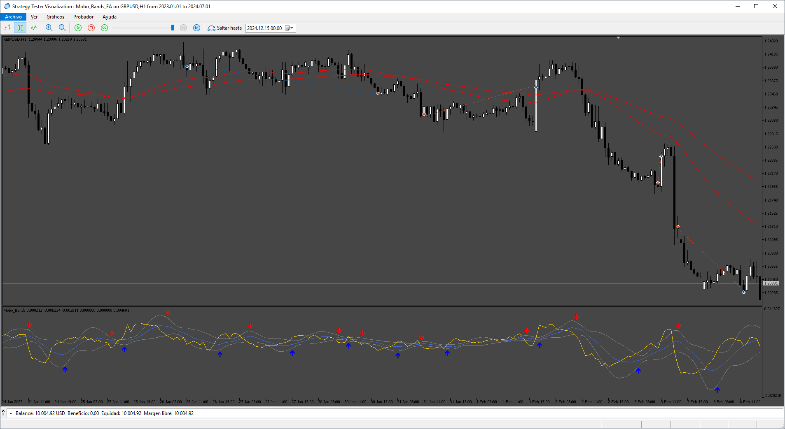

# Mobo_Bands_EA

> Source: https://fxcodebase.com/code/viewtopic.php?f=38&t=75262  
> Forum: 38 · Topic 75262 · 19 post(s)

---

## Mobo_Bands_EA

**Apprentice** · Sun Oct 06, 2024 3:09 am

 

Based on the request.
[https://fxcodebase.com/code/viewtopic.p ... 95#p156795](https://fxcodebase.com/code/viewtopic.php?f=27&p=156795#p156795)

 [Mobo_Bands.mq4](files/156887/Mobo_Bands.mq4)

 [Mobo_Bands_EA.mq4](files/156887/Mobo_Bands_EA.mq4)

---

## Re: Mobo_Bands_EA

**trtrader** · Sun Oct 06, 2024 7:59 pm

Thanks.

The arrows little bit different than in the Trading view. If it due to the Price Close option?

If so could you please add that too so we get the same signals?

Also, please add to EA Mobo bands indicator options.

Thanks

 

---

## Re: Mobo_Bands_EA

**Apprentice** · Wed Oct 09, 2024 12:36 pm

We have added your request to the development list.
Development reference 778

---

## Re: Mobo_Bands_EA

**trtrader** · Thu Oct 17, 2024 9:25 pm

Just wanted to check if any update on this.

Thanks

---

## Re: Mobo_Bands_EA

**VuxxLong** · Fri Oct 25, 2024 2:18 am

Could you please convert this also for MT5?
Thanks

---

## Re: Mobo_Bands_EA

**Apprentice** · Thu Oct 31, 2024 8:42 am

We have added your request to the development list.
Development reference 817

---

## Re: Mobo_Bands_EA

**Apprentice** · Sun Nov 10, 2024 3:48 pm

 [Mobo_Bands.mq5](files/157238/Mobo_Bands.mq5)

 [Mobo_Bands_EA.mq5](files/157238/Mobo_Bands_EA.mq5)

---

## Re: Mobo_Bands_EA

**trtrader** · Mon Dec 09, 2024 9:17 pm

Could you please create V2 with Early entry signals?

SELL: When yellow line crosses upper band from top to down.
BUY: When Yellow line crosses lower band from bottom to top.

- Indicator settings in EA's parameters (so we can adjust)
- Close opposite
- TP, SL and BE
- Trailing stop, start, stop, distance
- Working hours
- EMA Filter: By Default EMA 50 and EMA 100 (50 above 100 allow only buy and 50 below 100 allow only sell)

 

---

## Re: Mobo_Bands_EA

**Apprentice** · Fri Dec 13, 2024 4:25 pm

We have added your request to the development list.
Development reference 917

---

## Re: Mobo_Bands_EA

**trtrader** · Fri Dec 13, 2024 9:11 pm

> **Apprentice wrote:**
> We have added your request to the development list.
> Development reference 917

MQ4 please

---

## Re: Mobo_Bands_EA

**Apprentice** · Sat Dec 21, 2024 12:15 pm

 

 [Mobo_Bands_EA_v2.mq5](files/157598/Mobo_Bands_EA_v2.mq5)

---

## Re: Mobo_Bands_EA

**trtrader** · Sat Dec 21, 2024 10:11 pm

I was asking mq4

Could you please convert it?

---

## Re: Mobo_Bands_EA

**Apprentice** · Mon Dec 30, 2024 8:06 pm

We have added your request to the development list.
Development reference 942

---

## Re: Mobo_Bands_EA

**khanatd** · Tue Dec 31, 2024 8:33 am

hi sir plz check as when i install it in mt4 it says insatall mobo_bands indicator too, although i have already installed it in INdicators folder mql4

---

## Re: Mobo_Bands_EA

**[email protected]** · Thu Jan 02, 2025 12:04 pm

> **Apprentice wrote:**
>
>
> 753.png
>
>
>
>
> 753_ea.png
>
>
> Based on the request.
> [https://fxcodebase.com/code/viewtopic.p ... 95#p156795](https://fxcodebase.com/code/viewtopic.php?f=27&p=156795#p156795)
>
>
> Mobo_Bands.mq4
>
>
>
>
> Mobo_Bands_EA.mq4

Hi. happy new year.
please add super trend parameters: "calculate period" and "calculate deviation" in input of EA that user can change and optimize it. also add mobo bands parameters: "period", "mobo length" and "standard deviation bands" in input of EA. I want these parameters for MT4 version.
thanks.

---

## Re: Mobo_Bands_EA

**Apprentice** · Mon Jan 06, 2025 8:45 am

We have added your request to the development list.
Development reference 13

---

## Re: Mobo_Bands_EA

**Apprentice** · Mon Jan 06, 2025 8:45 am

This is EA, please install it in the EA folder.

---

## Re: Mobo_Bands_EA

**Apprentice** · Tue Jan 14, 2025 3:55 am

[Mobo_Bands_EA_v2.mq4](files/157793/Mobo_Bands_EA_v2.mq4)

---

## Re: Mobo_Bands_EA

**Apprentice** · Wed Jun 04, 2025 3:36 pm

Task 942

 [Mobo_Bands_v3.mq4](files/159452/Mobo_Bands_v3.mq4)

 [Mobo_Bands_EA_v3.mq4](files/159452/Mobo_Bands_EA_v3.mq4)
