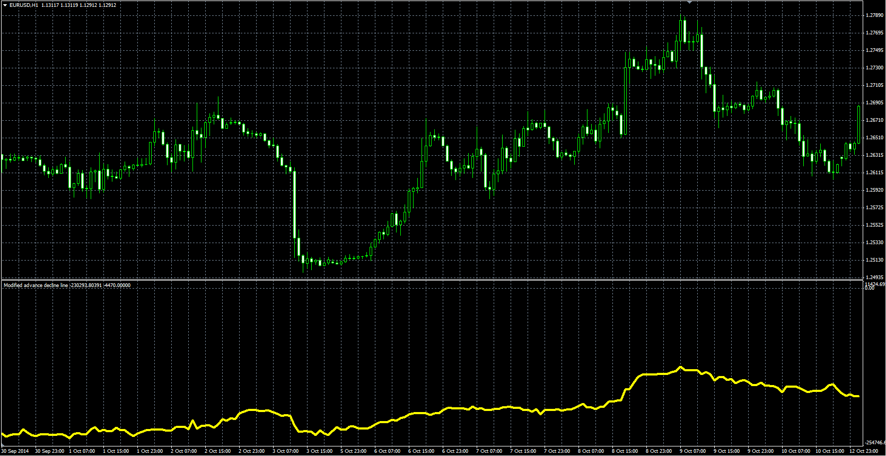

# Modified AdvanceDecline Line

> Source: https://fxcodebase.com/code/viewtopic.php?f=38&t=61983  
> Forum: 38 · Topic 61983 · 1 post(s)

---

## Modified AdvanceDecline Line

**Alexander.Gettinger** · Mon Mar 09, 2015 4:02 pm

Original LUA oscillator: [viewtopic.php?f=17&t=61228](https://fxcodebase.com/code/viewtopic.php?f=17&t=61228).

Formula:
MAD[i] = MAD[i-1]+(2*Close-High-Low)/(High-Low)*(Volume+MA), where
MA - MVA(Volume) with [Length] number of periods.

 

Download:

 [Modified_Advance_Decline_Line.mq4](files/99143/Modified_Advance_Decline_Line.mq4)
