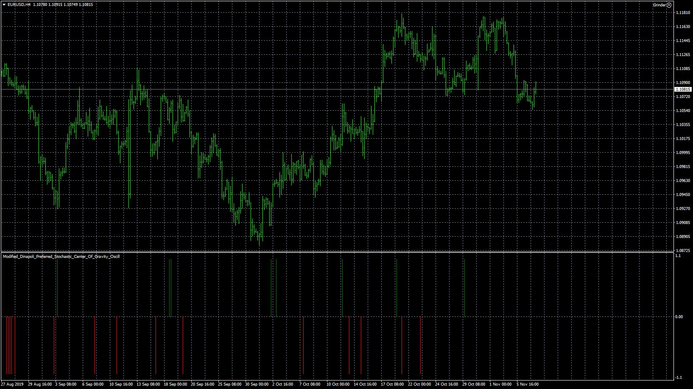

# Modified_Dinapoli_Preferred_Stochastic_Center_Of_Gravity_Osc

> Source: https://fxcodebase.com/code/viewtopic.php?f=38&t=69107  
> Forum: 38 · Topic 69107 · 1 post(s)

---

## Modified_Dinapoli_Preferred_Stochastic_Center_Of_Gravity_Osc

**Apprentice** · Thu Nov 07, 2019 9:16 am

Based on request.
[viewtopic.php?f=27&t=66626](https://fxcodebase.com/code/viewtopic.php?f=27&t=66626)

 [Modified_Dinapoli_Preferred_Stochastic_Center_Of_Gravity_Oscillator.mq4](files/129639/Modified_Dinapoli_Preferred_Stochastic_Center_Of_Gravity_Oscillator.mq4)

Dinapoli Preferred Stochastic
[viewtopic.php?f=38&t=61691](https://fxcodebase.com/code/viewtopic.php?f=38&t=61691)

KRI

 [KRI.mq4](files/129639/KRI.mq4)

CCI_MA_Difference

 [CCI_MA_Difference.mq4](files/129639/CCI_MA_Difference.mq4)

JECOG

 [JECOG.mq4](files/129639/JECOG.mq4)
