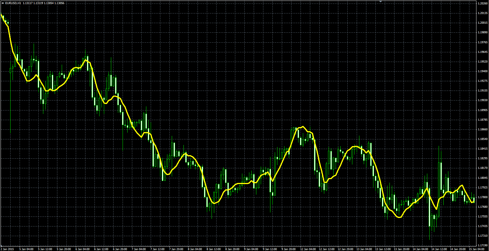

# Modified Moving Average

> Source: https://fxcodebase.com/code/viewtopic.php?f=38&t=61976  
> Forum: 38 · Topic 61976 · 1 post(s)

---

## Modified Moving Average

**Alexander.Gettinger** · Mon Mar 09, 2015 3:39 pm

This indicator has been described in Stocks&Commodities, January 2000.

Formula:
MMM = MA+6*Slope/K, where
MA - MVA(Price) with [Length] number of periods,
Slope(i) = Sum(Price[i-j+1]*(Length-Factor)/2), Factor = 1+2*(j-1) for j=1..Length,
K = Length*(Length+1).

 

Download:

 [Modified_Moving_Average.mq4](files/99130/Modified_Moving_Average.mq4)
