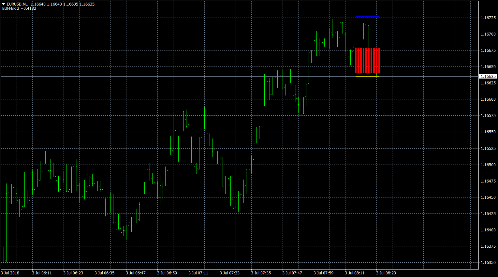

# Modified NCandle

> Source: https://fxcodebase.com/code/viewtopic.php?f=38&t=66241  
> Forum: 38 · Topic 66241 · 1 post(s)

---

## Modified NCandle

**Apprentice** · Tue Jul 03, 2018 5:24 am

TS2/Lua version
[viewtopic.php?f=17&t=2529](https://fxcodebase.com/code/viewtopic.php?f=17&t=2529)

Indicator for calculating the candle formed by the last N periods:

Open = Open price N periods ago
Close = Close price current period
High = Higher price of the last N periods
Low = Lower price of the last N periods

 [Modified NCandle.mq4](files/119791/Modified%20NCandle.mq4)
