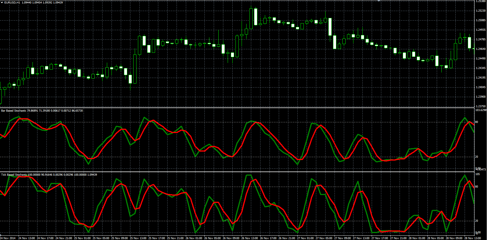
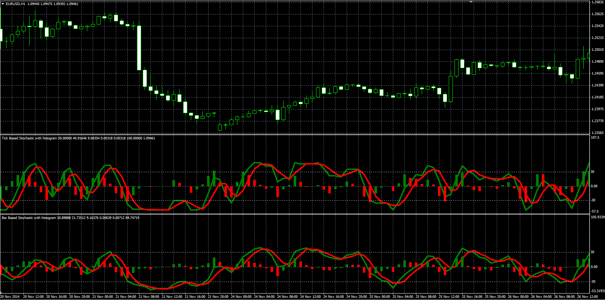

# Modified stochastic

> Source: https://fxcodebase.com/code/viewtopic.php?f=38&t=62082  
> Forum: 38 · Topic 62082 · 1 post(s)

---

## Modified stochastic

**Alexander.Gettinger** · Wed Apr 08, 2015 10:43 am

Original LUA oscillators: [viewtopic.php?f=17&t=9566](https://fxcodebase.com/code/viewtopic.php?f=17&t=9566).

**BBS:**
Formulas:
K = MA(FastK) with [D_Slowing] number of periods and [K_Smoothing_Method] type,
D = MA(K) with [D_Length] number of periods and [D_Smoothing_Method] type, where
FastK[i] = 100*mins[i]/maxes[i],
mins[i] = Close[i]-minLow,
maxes[i] = maxHigh-minLow,
minLow, maxHigh - minimum and maximum prices at range from (i-K_Length+1) to (i).

**TBS:**
Formulas:
K = MA(FastK) with [D_Slowing] number of periods and [K_Smoothing_Method] type,
D = MA(K) with [D_Length] number of periods and [D_Smoothing_Method] type, where
FastK[i] = 100*mins[i]/maxes[i],
mins[i] = Price[i]-minLow,
maxes[i] = maxHigh-minLow,
minLow, maxHigh - minimum and maximum specified prices at range from (i-K_Length+1) to (i).

 

Download:

 [BBS.mq4](files/99670/BBS.mq4)

 [TBS.mq4](files/99670/TBS.mq4)

**Stochastic with histogram:**

 

Download:

 [BBS_Histogram.mq4](files/99670/BBS_Histogram.mq4)

 [TBS_Histogram.mq4](files/99670/TBS_Histogram.mq4)
