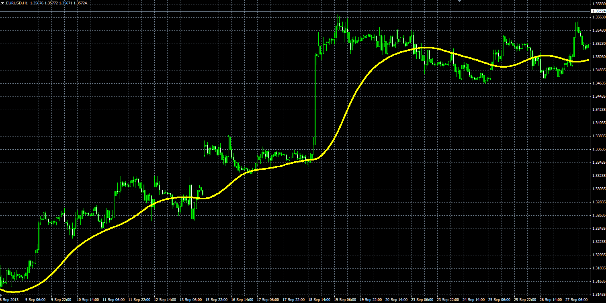

# Modified Wilders smooting average indicator

> Source: https://fxcodebase.com/code/viewtopic.php?f=38&t=59623  
> Forum: 38 · Topic 59623 · 1 post(s)

---

## Modified Wilders smooting average indicator

**Alexander.Gettinger** · Tue Oct 08, 2013 12:01 pm

The indicator is very similar to the WMA ([viewtopic.php?f=38&t=59621](https://fxcodebase.com/code/viewtopic.php?f=38&t=59621)).

Formulas for WMA:
WMA[i] = (Price[i] - WMA[i-1])*k + WMA[i-1], where
k = 1/Length.

Formulas for Mod. WMA:
ModWMA[i] = (MVA(i) - ModWMA[i-1])*k + ModWMA[i-1], where
k = 1/Length.

 

Download:

 [Mod_WMA.mq4](files/89897/Mod_WMA.mq4)
