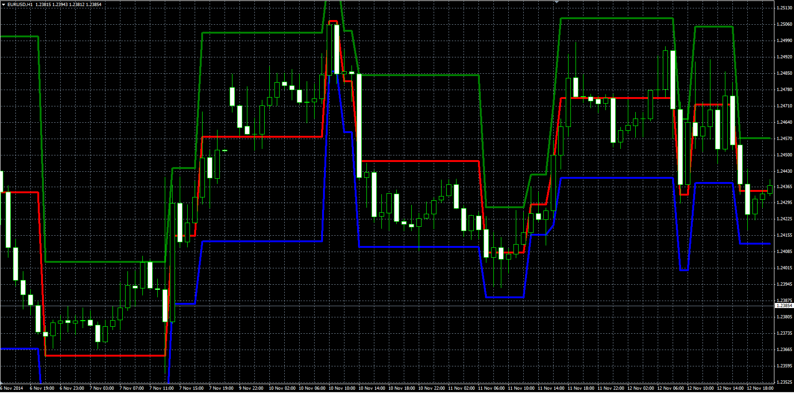

# Mogalef Bands

> Source: https://fxcodebase.com/code/viewtopic.php?f=38&t=61512  
> Forum: 38 · Topic 61512 · 3 post(s)

---

## Mogalef Bands

**Alexander.Gettinger** · Fri Nov 21, 2014 4:48 pm

Original LUA indicator: [viewtopic.php?f=17&t=4449](https://fxcodebase.com/code/viewtopic.php?f=17&t=4449).

 

Download:

 [Mogalef.mq4](files/97279/Mogalef.mq4)

---

## Re: Mogalef Bands

**alpha24** · Sat Apr 11, 2015 6:19 pm

Hi,
will you please make this indicator color filled? as
[http://www.smart-trading.world-record.c ... ogalef.png](http://www.smart-trading.world-record.ch/en/images/mogalef.png)
thanks

---

## Re: Mogalef Bands

**Apprentice** · Sun Apr 12, 2015 6:29 am

Your request is added to the development list.
