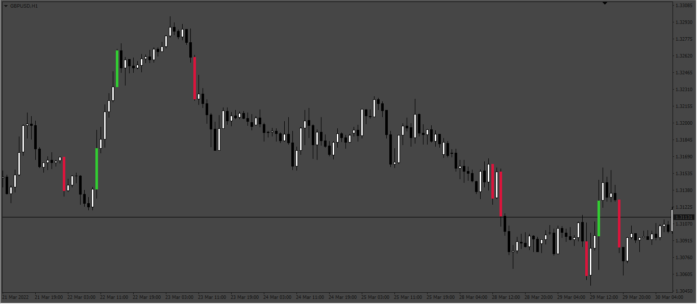

# Momentum Candles

> Source: https://fxcodebase.com/code/viewtopic.php?f=38&t=72040  
> Forum: 38 · Topic 72040 · 5 post(s)

---

## Momentum Candles

**Apprentice** · Mon Apr 04, 2022 1:59 pm

Based on the request.
[https://fxcodebase.com/code/viewtopic.php?f=27&p=144661](https://fxcodebase.com/code/viewtopic.php?f=27&p=144661)

 [Momentum Candles.mq4](files/145547/Momentum%20Candles.mq4)

---

## Re: Momentum Candles

**forexryk** · Fri Sep 08, 2023 2:08 am

kindly add this function show signal on current bar instead bar close
and never re paint again when pip match thank you in advance.

---

## Re: Momentum Candles

**Apprentice** · Sun Sep 10, 2023 2:39 pm

We have added your request to the development list.
Development reference 819.

---

## Re: Momentum Candles

**forexryk** · Sun Sep 10, 2023 8:38 pm

> **Apprentice wrote:**
> We have added your request to the development list.
> Development reference 819.

i am not able to find this indicator with Development reference 819

can you send me again link of this request indicator that show signal on current bar instead bar close and never re paint thank you again

---

## Re: Momentum Candles

**Apprentice** · Sun Sep 24, 2023 3:37 am

[Momentum_Candles_v2.mq4](files/152660/Momentum_Candles_v2.mq4)

Try this version.
