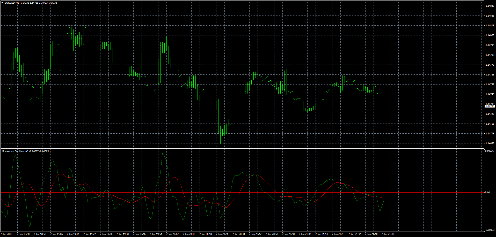

# Momentum Oscillator

> Source: https://fxcodebase.com/code/viewtopic.php?f=38&t=67247  
> Forum: 38 · Topic 67247 · 2 post(s)

---

## Momentum Oscillator

**Apprentice** · Mon Jan 07, 2019 6:46 pm

Based on TS2/Lua version.
[viewtopic.php?f=17&t=67245](https://fxcodebase.com/code/viewtopic.php?f=17&t=67245)

 [Momentum Oscillator.mq4](files/123254/Momentum%20Oscillator.mq4)

If used, please, install the 'Volume Weighted Moving Average' indicator. [viewtopic.php?f=38&t=67144](https://fxcodebase.com/code/viewtopic.php?f=38&t=67144)"

---

## Re: Momentum Oscillator

**logicgate** · Mon Jan 07, 2019 6:52 pm

Marvelous!!!
