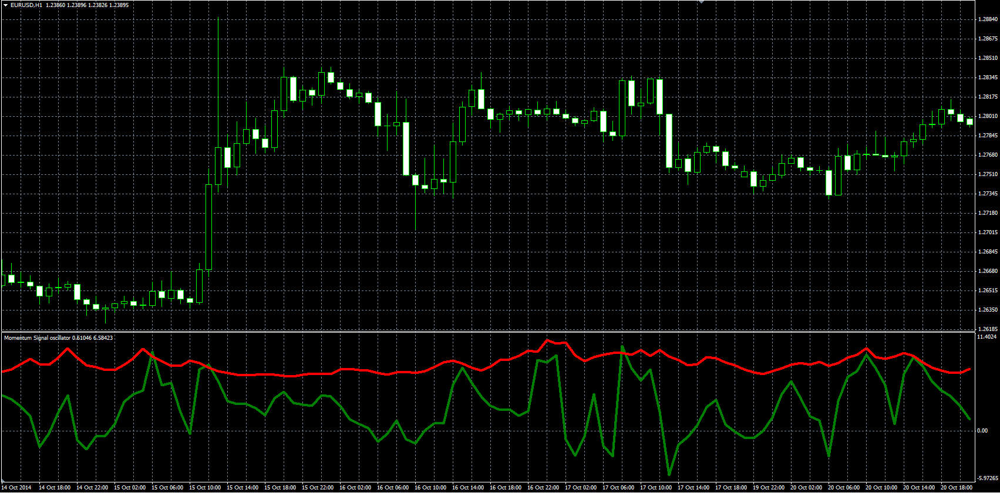

# Momentum Signal Indicator

> Source: https://fxcodebase.com/code/viewtopic.php?f=38&t=61521  
> Forum: 38 · Topic 61521 · 1 post(s)

---

## Momentum Signal Indicator

**Alexander.Gettinger** · Fri Nov 21, 2014 5:17 pm

Original LUA indicator: [viewtopic.php?f=17&t=4303](https://fxcodebase.com/code/viewtopic.php?f=17&t=4303).

Formulas:
Momentum = (ATR+CCI+RSI)/ADX-Substract_From_Indicator,
Signal = Momentum/(ATR+ADX)-Substract_From_Signal.

 

Download:

 [Momentum_Signal.mq4](files/97295/Momentum_Signal.mq4)
