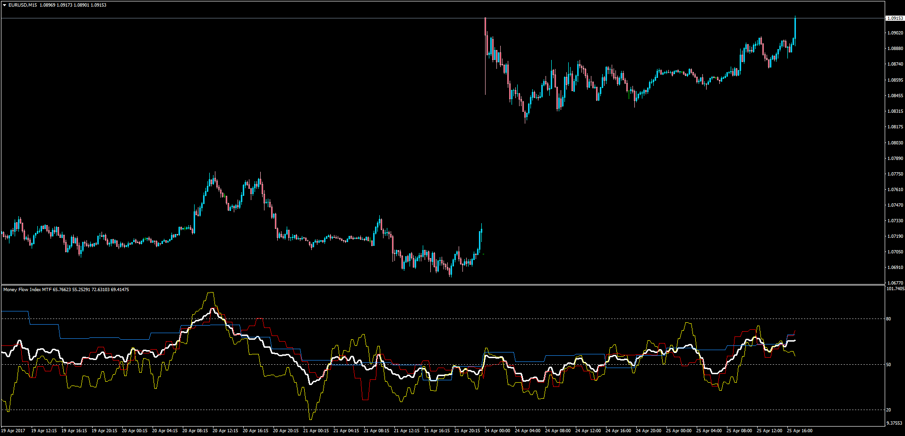

# Money Flow Index MTF with Average

> Source: https://fxcodebase.com/code/viewtopic.php?f=38&t=64621  
> Forum: 38 · Topic 64621 · 1 post(s)

---

## Money Flow Index MTF with Average

**Apprentice** · Wed Apr 26, 2017 4:38 am

LUA Original: [viewtopic.php?f=17&t=20165](https://fxcodebase.com/code/viewtopic.php?f=17&t=20165)

Description:

This is the MT4 version of the LUA Original "3 TF MFI Average". In this version the indicator will draw each of the 3 MTF MFI's and then calculate the average.

The average line is always visible while the MTF MFI Lines can be hidden.

 [MFI_MTF.mq4](files/112146/MFI_MTF.mq4)
