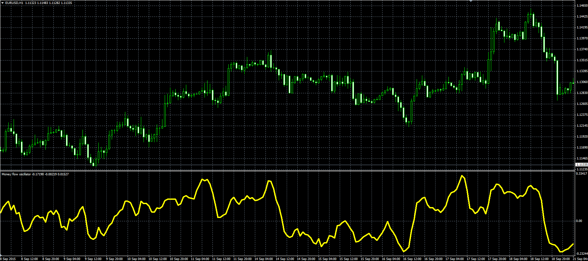

# Money Flow oscillator

> Source: https://fxcodebase.com/code/viewtopic.php?f=38&t=62693  
> Forum: 38 · Topic 62693 · 1 post(s)

---

## Money Flow oscillator

**Alexander.Gettinger** · Tue Sep 22, 2015 11:39 am

This indicator has been described in the Stock&Commodities (October 2015).

Formula:
MFO = Sum(MFV)/Sum(Volume) with [Period] number of periods, where
MFV = Multiplier*Volume,
Multiplier[i] = [(High[i]-Low[i-1])-(High[i-1]-Low[i])]/[(High[i]-Low[i-1])+(High[i-1]-Low[i])].

 

Download:

 [MFO.mq4](files/102471/MFO.mq4)
