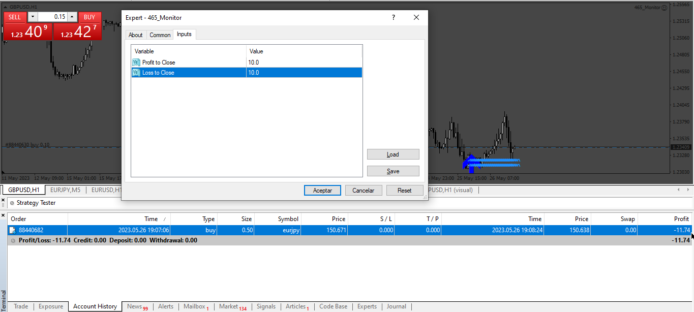

# Monitor

> Source: https://fxcodebase.com/code/viewtopic.php?f=38&t=73773  
> Forum: 38 · Topic 73773 · 1 post(s)

---

## Monitor

**Apprentice** · Sat May 27, 2023 3:55 am

Based on the request.
[https://fxcodebase.com/code/viewtopic.php?f=27&p=150958](https://fxcodebase.com/code/viewtopic.php?f=27&p=150958)
EA can monitor the profits of all orders in the current account in real-time.
When the profit of an order is greater than a certain amount, the order will be closed immediately.

 [Monitor.mq4](files/151032/Monitor.mq4)
