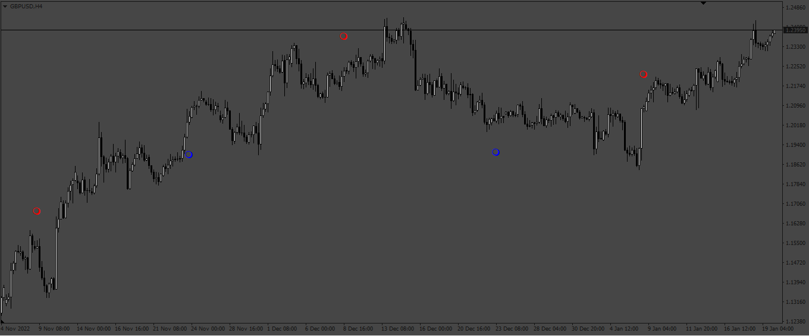

# MoonFazes

> Source: https://fxcodebase.com/code/viewtopic.php?f=38&t=73252  
> Forum: 38 · Topic 73252 · 3 post(s)

---

## MoonFazes

**Apprentice** · Fri Jan 20, 2023 11:20 am

Based on the request.
[https://fxcodebase.com/code/viewtopic.php?f=38&t=73184](https://fxcodebase.com/code/viewtopic.php?f=38&t=73184)

 [Moon Phases.mq4](files/149194/Moon%20Phases.mq4)

---

## Re: MoonFazes

**compoundtraders** · Fri Jan 20, 2023 10:26 pm

Hello

Is this a direct conversion of the code or are you finding existing indicators that do approximately the same job?

Cheers

---

## Re: MoonFazes

**Apprentice** · Mon Jan 23, 2023 11:44 am

I take the lunar circle equation from other develepers.
