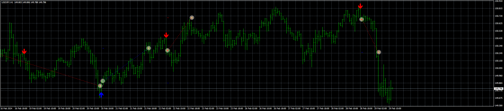

# Morning-evening_star_EA_v1.00

> Source: https://fxcodebase.com/code/viewtopic.php?f=38&t=74651  
> Forum: 38 · Topic 74651 · 4 post(s)

---

## Morning-evening_star_EA_v1.00

**Apprentice** · Thu Feb 29, 2024 5:03 am

Based on the request.
[https://fxcodebase.com/code/viewtopic.php?f=17&t=74475](https://fxcodebase.com/code/viewtopic.php?f=17&t=74475)

 [Morning-evening_star.mq4](files/154538/Morning-evening_star.mq4)

 [Morning-evening_star_EA_v1.00.mq4](files/154538/Morning-evening_star_EA_v1.00.mq4)

 [Morning-evening_star.mq5](files/154538/Morning-evening_star.mq5)

 [Morning-evening_star_EA_v1.00.mq5](files/154538/Morning-evening_star_EA_v1.00.mq5)

---

## Re: Morning-evening_star_EA_v1.00

**emaile.widi** · Tue Jun 25, 2024 3:44 am

Please activate martin for this EA

---

## Re: Morning-evening_star_EA_v1.00

**Apprentice** · Tue Jul 02, 2024 3:39 pm

We have added your request to the development list.
Development reference 539

---

## Re: Morning-evening_star_EA_v1.00

**Apprentice** · Mon Jul 08, 2024 1:51 pm

[Morning-evening_star_EA_v1.10.mq4](files/156054/Morning-evening_star_EA_v1.10.mq4)

 [Morning-evening_star_EA_v1.10.mq5](files/156054/Morning-evening_star_EA_v1.10.mq5)
