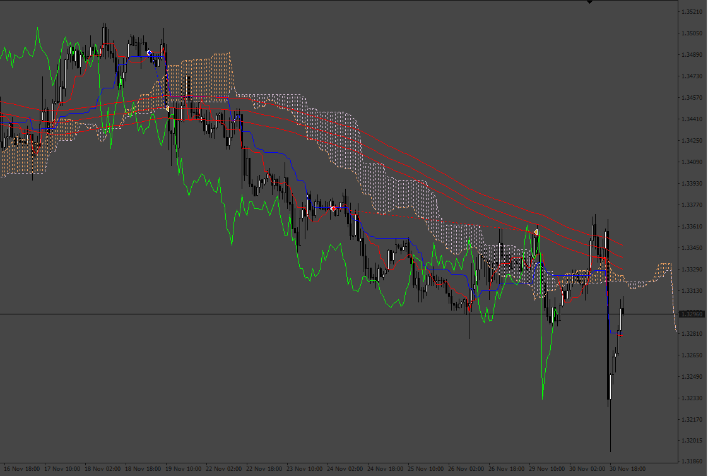
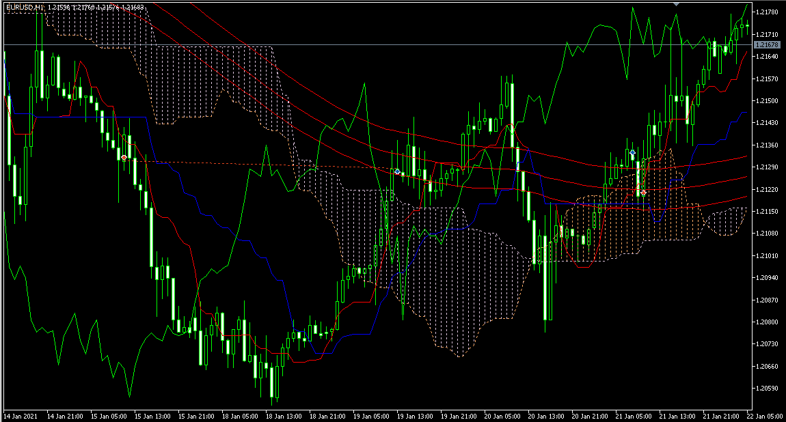

# Moving average and ichimoku EA

> Source: https://fxcodebase.com/code/viewtopic.php?f=38&t=71949  
> Forum: 38 · Topic 71949 · 4 post(s)

---

## Moving average and ichimoku EA

**Apprentice** · Wed Mar 09, 2022 3:09 pm

Based on the request.
[https://fxcodebase.com/code/viewtopic.php?f=27&p=145237](https://fxcodebase.com/code/viewtopic.php?f=27&p=145237)

 [Moving average and ichimoku EA.mq4](files/145279/Moving%20average%20and%20ichimoku%20EA.mq4)

 

 [Moving average and ichimoku EA.mq5](files/145279/Moving%20average%20and%20ichimoku%20EA.mq5)

---

## Re: Moving average and ichimoku EA

**gyrics** · Fri Mar 11, 2022 12:23 pm

Hi Admin
can we get the MT5 version

---

## Re: Moving average and ichimoku EA

**Apprentice** · Mon Mar 14, 2022 8:22 am

Your request is added to the development list.
Development reference 160.

---

## Re: Moving average and ichimoku EA

**Apprentice** · Tue Mar 29, 2022 7:36 am

MT5 version added.
