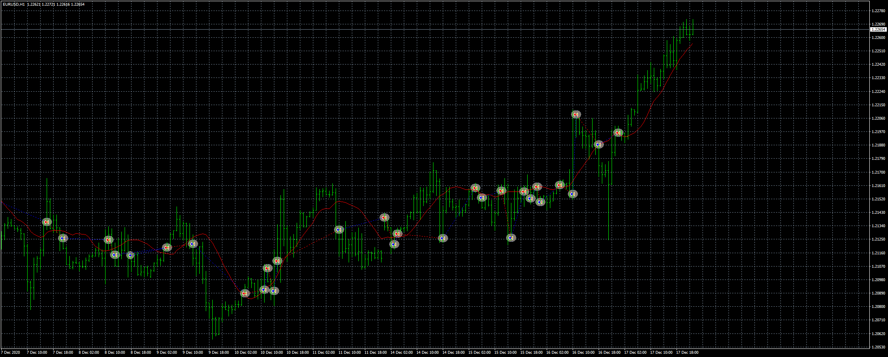
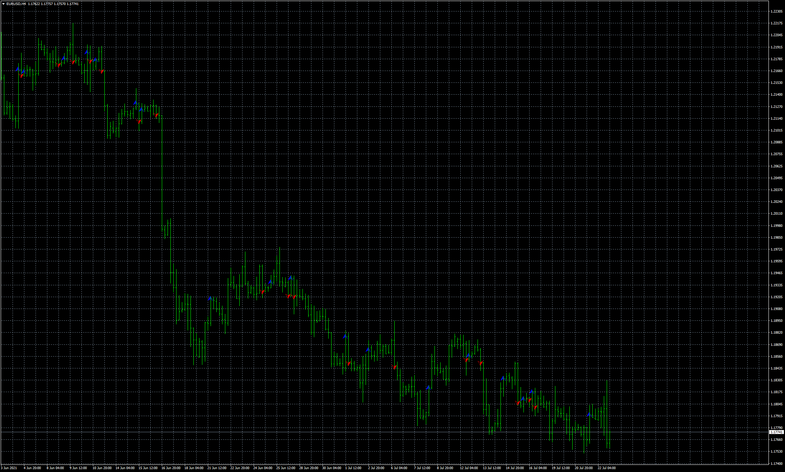

# Moving_Average_and_Price_crossover EA

> Source: https://fxcodebase.com/code/viewtopic.php?f=38&t=71335  
> Forum: 38 · Topic 71335 · 7 post(s)

---

## Moving_Average_and_Price_crossover EA

**Apprentice** · Thu Jul 08, 2021 11:18 am

Based on the request.
[https://fxcodebase.com/code/viewtopic.php?f=38&t=71324](https://fxcodebase.com/code/viewtopic.php?f=38&t=71324)

 [Moving_Average_and_Price_crossover EA.mq4](files/142754/Moving_Average_and_Price_crossover%20EA.mq4)

---

## Re: Moving_Average_and_Price_crossover EA

**baccicin** · Fri Jul 16, 2021 1:45 pm

hello, I am afraid that the EA does not open the position considering the close of the previous candle. Would you have a chance to check please? I mean, for example, the current candle close above the high of the MA, the EA should open a long position when the new candle starts. The same for a short position, if the current candle close below the low of the MA, the EA should open the short position when the next candle starts.
I hope not to create confusion due to my bad English...
And also:
- Is it possible you add the possibility to decide the "shift" of the moving average and the color for both moving averages, style, pixel dimension
The EA should also draw the Moving Averages
Thank you very much, have a nice week end

---

## Re: Moving_Average_and_Price_crossover EA

**baccicin** · Sun Jul 18, 2021 5:40 am

Hello, sorry, i need to change my mind, is it possible you convert this EA into a simple Indicator?
Just one alert (sound and popup) and one arrow when
- the previous candle close is above the first moving average
- the previous candle close is below the second moving average
--- only one alert and one arrow when the candle close is above or below the moving averages for the first cross
-----the indicator should ask me all the parameters:
-the value of the first moving average;
-the method (exponential, simple etc etc);
-the applied price (high, low, close etc etc)
-the value of the second moving average;
-the method (exponential, simple etc etc);
-the applied price (high, low, close etc etc)
-the colour for both moving average, style, pixel dimension
Thank you for your patience and for this change. if you can not make the change there are no problems, I realize that I have messed up too much and complicated your job.
Thnks, have a nice Sunday

---

## Re: Moving_Average_and_Price_crossover EA

**Apprentice** · Mon Jul 19, 2021 6:03 am

Your request is added to the development list.
Development reference 659.

---

## Re: Moving_Average_and_Price_crossover EA

**Apprentice** · Mon Jul 19, 2021 12:29 pm

I don't understand why the second moving average is needed since it isn't used

---

## Re: Moving_Average_and_Price_crossover EA

**baccicin** · Mon Jul 19, 2021 2:01 pm

hi, because i want to try the first move with the applied price and the second one with another applied price, combining them with a method for the first and another method for the second one.
in the end it is a channel but I would like to try the various combinations in this way even if it may seem stupid I would like to try, for this reason I ask you to leave the boxes "free" so I can write the various parameters from time to time
Thank you very much
Ciao

---

## Re: Moving_Average_and_Price_crossover EA

**Apprentice** · Thu Jul 22, 2021 9:51 am

 [Moving_Average_and_Price_crossover.mq4](files/142922/Moving_Average_and_Price_crossover.mq4)

Try this version.
