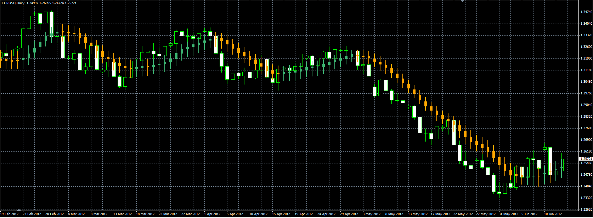

# Moving average candles

> Source: https://fxcodebase.com/code/viewtopic.php?f=38&t=20177  
> Forum: 38 · Topic 20177 · 3 post(s)

---

## Moving average candles

**Alexander.Gettinger** · Wed Jun 13, 2012 3:08 pm

Moving average as a candle.
Open of candle is a MA for open price, close of candle is a MA for close price and etc.

 

Download:

 [MA_Candles.mq4](files/35478/MA_Candles.mq4)

---

## Re: Moving average candles

**tadinda** · Tue Jul 03, 2012 4:03 pm

I have been playing with the above indicator and came up with some very good results I think which I would like to share.

I set up the indicator twice on the same chart with different periods naturally. I use 5 and 20.
What I noticed is that when the colors of the bars are the same it indicates that we can enter either long or short depending upon the colour. If the administration will authorise I can send some screenshots.

If you find this strategy interesting some work needs to be done on the indicator. Which includes:

1. Allow for two MAs to be input into the indicator.
2. A sound alert when the two candles are of the same colour.

Look forward to receiving comments.

---

## Re: Moving average candles

**tadinda** · Tue Jul 03, 2012 4:06 pm

Further to my message earlier forgot to mention some improvements which maybe added to the TO Do List: These are:

1. The alert should sound when the bars are the same colour as stated in my earlier message and when they are not. The first would indicate a possible entry and the other would indicate an exit.
2. The sound alerts should contain the Pair and the Time Frame.
3. The alerts should not be repetitive.

Sorry for any inconvenience caused with writing two messages instead of one.
