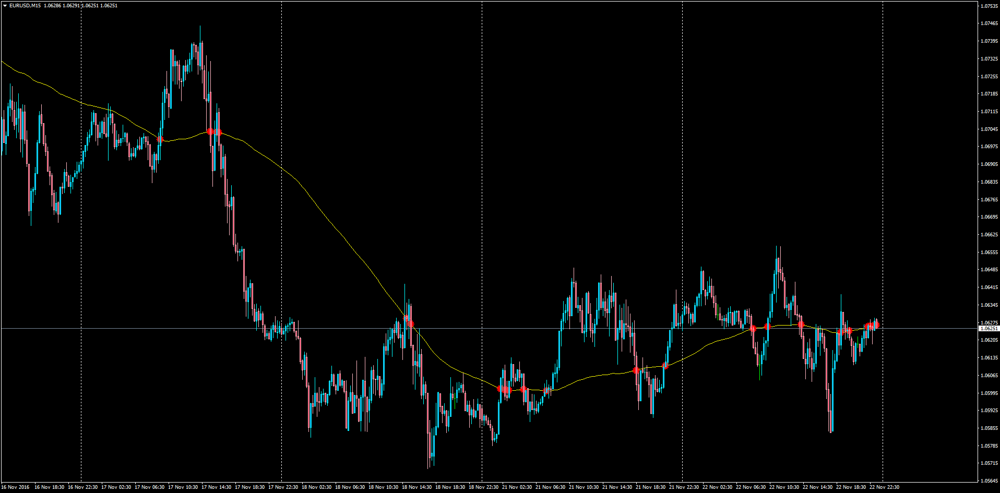

# Moving Average Cross Signals

> Source: https://fxcodebase.com/code/viewtopic.php?f=38&t=64128  
> Forum: 38 · Topic 64128 · 5 post(s)

---

## Moving Average Cross Signals

**Apprentice** · Tue Nov 22, 2016 6:32 pm

LUA Original: [viewtopic.php?f=17&t=2451](https://fxcodebase.com/code/viewtopic.php?f=17&t=2451)

Description:

This indicator will display historical signals everytime Price touched or crossed the selected moving average and will also alert the trader in real time. Optional Email Alert included.

 [MA_Cross_Alert.mq4](files/109171/MA_Cross_Alert.mq4)

---

## Re: Moving Average Cross Signals

**evansrono** · Wed Sep 23, 2020 9:38 am

Hi.

Is it possible to add alerts on the close of a candle above /below the lines with each horizontal line MTF enabled such that when H4 candle closes above/below while in Daily timeframe the alert is triggered. Thanks.

Regards

---

## Re: Moving Average Cross Signals

**Apprentice** · Thu Sep 24, 2020 2:41 am

Your request is added to the development list.
Development reference 2098.

---

## Re: Moving Average Cross Signals

**evansrono** · Thu Sep 24, 2020 3:14 am

Hi,

Forgot. the additional horizontal lines with alerts to be eight in number. Thanks.

Regards

---

## Re: Moving Average Cross Signals

**Apprentice** · Sat Sep 26, 2020 2:14 am

[MA_Cross_Alert_BTF.mq4](files/137917/MA_Cross_Alert_BTF.mq4)

Try this version.
