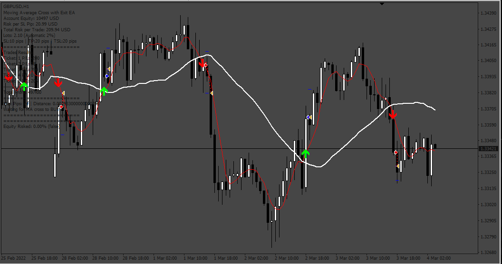
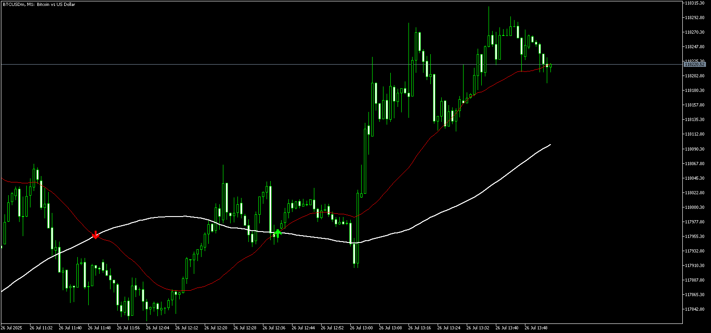
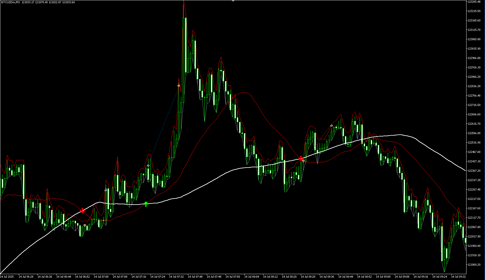

# Moving Average Cross with Exit Expert Advisor

> Source: https://fxcodebase.com/code/viewtopic.php?f=38&t=64520  
> Forum: 38 · Topic 64520 · 30 post(s)

---

## Moving Average Cross with Exit Expert Advisor

**Apprentice** · Mon Mar 13, 2017 5:40 am

Description:

This is an interesting MA Cross Expert Advisor that includes Exit rules. The EA will exit a trade either by SL/TP hit or by exit rules given by opposite MA crossings, whatever comes first. Results are interesting because that MA3 (which can be half way between MA1 and MA2) helps to protect the trade anticipating a change of trend.

Expert Advisor Entry Rules:

- Go Long when MA1 crosses above the MA2
- Go Short when MA1 crosses below the MA2

Expert Advisor Exit Rules:

- The traditional SL, TP and TSL
- Close Long and Short trades when the MA1 crosses either the MA3 or MA2 in opposite direction of the entry trigger

Where:

- MA can be any of 17 different Moving Averaging methods
- Price Type, MA Method and MA Period for each MA can be changed

Notes:

- Two_MA_Cross_Indicator.mq4 required (installed in the Indicators folder)

EA Features:

- EA can be turned on and off
- Distance of Price with Slow MA to approve Entry (if too far away, trade is not executed)
- More than 1 trade can be opened at once
- Minutes to Wait for Next Open Trade
- Stop Loss, Take Profit and Trailing Stop Loss options
- AutoLots or Manual
- Trade Both Sides or only one direction
- Comments Displayed on Screen
- Optional Email and Sound Alerts

 [Two_MA_Cross_Indicator.mq4](files/111433/Two_MA_Cross_Indicator.mq4)

 [MA_Cross_with_Exit_EA.mq4](files/111433/MA_Cross_with_Exit_EA.mq4)

---

## Re: Moving Average Cross with Exit Expert Advisor

**Ehab.Ali** · Mon Mar 13, 2017 10:06 am

perfect
thanks a lot man

**but triling stop working with buy only not working with sell**

pleas check that

thanks again

---

## Re: Moving Average Cross with Exit Expert Advisor

**Mandelbrot** · Mon Mar 13, 2017 5:06 pm

I see the same comment like in the "Two MA Cross Expert Advisor" posted here [viewtopic.php?f=38&t=64500](https://fxcodebase.com/code/viewtopic.php?f=38&t=64500) but I ran the strategy tester in both and the TSL worked for sell orders with no problem.

Parameters are the following:

MA1: 5 SMA
MA2: 30 SMA
MA3: 10 SMA

SL: 200 (points, so it means 20 pips)
TP: 400
TSL: 150
TStep: 50

I attach a random Sell order from the test and you can notice that the order first modification is for setting the initial SL and TP. The second when the difference of the entry price and the TSL is 15 pips and then one modification every 5 pips.

---

## Re: Moving Average Cross with Exit Expert Advisor

**Ehab.Ali** · Tue Mar 14, 2017 5:33 am

> **Mandelbrot wrote:**
> I see the same comment like in the "Two MA Cross Expert Advisor" posted here [viewtopic.php?f=38&t=64500](https://fxcodebase.com/code/viewtopic.php?f=38&t=64500) but I ran the strategy tester in both and the TSL worked for sell orders with no problem.
>
> Parameters are the following:
>
> MA1: 5 SMA
> MA2: 30 SMA
> MA3: 10 SMA
>
> SL: 200 (points, so it means 20 pips)
> TP: 400
> TSL: 150
> TStep: 50
>
> I attach a random Sell order from the test and you can notice that the order first modification is for setting the initial SL and TP. The second when the difference of the entry price and the TSL is 15 pips and then one modification every 5 pips.

yes it works you are right but it works only when you put tp (number) and sl (number)
but when i put sl 0 and tp 0 to make it disabled
it only work with buy and not work with sell

---

## Re: Moving Average Cross with Exit Expert Advisor

**Apprentice** · Thu Mar 16, 2017 4:46 am

Update.

---

## Re: Moving Average Cross with Exit Expert Advisor

**Ehab.Ali** · Thu Mar 16, 2017 7:37 am

> **Apprentice wrote:**
> Update.

THANKS A LOT MAN
NOW IT WORKS FINE
THANKS

---

## Re: Moving Average Cross with Exit Expert Advisor

**Apprentice** · Tue Mar 21, 2017 4:21 am

This is a major update to the following Expert Advisors:

- Multi Indicator EA
- Two MA Cross EA
- MA Cross with Exit EA

The following improvements have been made:

- Now the trader sets the number of pips rather than points (no more thinking about how many points to set, simply write 20 for 20 pips and that's it).
- EA can be activated/deactivated to trade or not
- Auto Lots calculation has been revised and is working properly
- Comments displayed on chart give more information about risk, lots, equity, opened orders
- (By the way, trades comments can be turned off to avoid the comments area to keep growing)

Additions:

The trader can now estipulate a maximum percentage of risk for open trades. For example the risk can be 2% per trade and the maximum 7% of the equity. The user can also choose the number of opened trades at the same time, for example 5.

So the way it works is that once the SL has moved to breakeven, then the risk for that trade is no longer considered in the equity providing additional room for opening further trades if necessary. It could be, for instance, that there were 3 opened trades but the 4th one was opened when one of the prior 3 moved to B/E.

Also, the trader could decide to have the same fixed lots every time and again set a maximum number of lots traded. For example 1 lot per trade and a maximum of 4 lots in total.

One note about the trailing stop

The way the Stop Loss works is to initially protect the trade, say with 20 pips. If the user additionally sets a trailing stop (TSL) of 15 pips with a 5 pips step, it will not work until the trade is in profit. This means they are two different concepts. The TSL will be activated when the trade is 15 pips in the green and then correct itself every 5 pips (step).

---

## Re: Moving Average Cross with Exit Expert Advisor

**seunboi4u** · Fri Nov 17, 2017 10:02 am

i really say thanks to the writer of the this EA....please i test my settings with one min but did not execute the trade and please can we get the indicator that i can set like this EA to Alert.......God bless

---

## Re: Moving Average Cross with Exit Expert Advisor

**seunboi4u** · Fri Nov 17, 2017 10:10 am

im sorry please i want to give a test very well but i will like to get the same configuration but it will be indicator with Alert thanks

---

## Re: Moving Average Cross with Exit Expert Advisor

**Apprentice** · Sun Nov 19, 2017 4:31 pm

Your request is added to the development list under Id Number 3952

---

## Re: Moving Average Cross with Exit Expert Advisor

**Apprentice** · Tue Nov 28, 2017 6:00 am

Try this version.

 [MA_Cross_with_Exit_Indicator.mq4](files/116262/MA_Cross_with_Exit_Indicator.mq4)

---

## Re: Moving Average Cross with Exit Expert Advisor

**ALI YASEEN** · Mon Jun 22, 2020 1:20 pm

hello dear , thanks for great work I been test the EA with optimize setting get good results but when I install it to the chart show me msg Please, install the 'Two_MA_Cross_Indicator' indicator

which indicator ?

---

## Re: Moving Average Cross with Exit Expert Advisor

**Apprentice** · Tue Jun 23, 2020 3:45 am

Two_MA_Cross_Indicator.mq4
[viewtopic.php?f=38&t=64500](https://fxcodebase.com/code/viewtopic.php?f=38&t=64500)

---

## Re: Moving Average Cross with Exit Expert Advisor

**Albahri65** · Wed Jul 08, 2020 10:55 am

> **Apprentice wrote:**
>
>
> MA Cross with Exit EA.jpg
>
>
> Description:
>
> This is an interesting MA Cross Expert Advisor that includes Exit rules. The EA will exit a trade either by SL/TP hit or by exit rules given by opposite MA crossings, whatever comes first. Results are interesting because that MA3 (which can be half way between MA1 and MA2) helps to protect the trade anticipating a change of trend.
>
> Expert Advisor Entry Rules:
>
> - Go Long when MA1 crosses above the MA2
> - Go Short when MA1 crosses below the MA2
>
> Expert Advisor Exit Rules:
>
> - The traditional SL, TP and TSL
> - Close Long and Short trades when the MA1 crosses either the MA3 or MA2 in opposite direction of the entry trigger
>
> Where:
>
> - MA can be any of 17 different Moving Averaging methods
> - Price Type, MA Method and MA Period for each MA can be changed
>
> Notes:
>
> - Two_MA_Cross_Indicator.mq4 required (installed in the Indicators folder)
>
> EA Features:
>
> - EA can be turned on and off
> - Distance of Price with Slow MA to approve Entry (if too far away, trade is not executed)
> - More than 1 trade can be opened at once
> - Minutes to Wait for Next Open Trade
> - Stop Loss, Take Profit and Trailing Stop Loss options
> - AutoLots or Manual
> - Trade Both Sides or only one direction
> - Comments Displayed on Screen
> - Optional Email and Sound Alerts
>
>
> MA_Cross_with_Exit_EA.mq4
>
>
>
> Two_MA_Cross_Indicator.mq4
> [viewtopic.php?f=38&t=64500](https://fxcodebase.com/code/viewtopic.php?f=38&t=64500)

One of the best EA I have ever used. Thank you so much for excellent job.

But, I think there is small modification required. from my observation, I think trailing stop field should be changed to "Trailing step". And, trailing step field should be changed to "Trailing stop".

Generally, i think TStop and TStep functions need to be checked again because I feel they are not functioning correctly.

---

## Re: Moving Average Cross with Exit Expert Advisor

**Apprentice** · Thu Jul 09, 2020 4:30 am

Your request is added to the development list.
Development reference 1657.

---

## Re: Moving Average Cross with Exit Expert Advisor

**Albahri65** · Thu Jul 09, 2020 6:04 am

> **Apprentice wrote:**
> Your request is added to the development list.
> Development reference 1657.

Thank you so much for following up.
Also, we are confused just little, because you advice us to use this indicatior: [viewtopic.php?f=38&t=64500](https://fxcodebase.com/code/viewtopic.php?f=38&t=64500) But, this one has two two MA Period values and the EA needs three MA Period values. Please advice.

---

## Re: Moving Average Cross with Exit Expert Advisor

**Apprentice** · Tue Jul 14, 2020 7:32 am

[MA_Cross_with_Exit_Indicator.mq4](files/135948/MA_Cross_with_Exit_Indicator.mq4)

Try this version.

---

## Re: Moving Average Cross with Exit Expert Advisor

**Albahri65** · Sat Aug 01, 2020 5:38 am

> **Apprentice wrote:**
>
>
> MA_Cross_with_Exit_Indicator.mq4
>
>
> Try this version.

It gives this error message: "Please install the "Two MA cross indicator" indicator"

---

## Re: Moving Average Cross with Exit Expert Advisor

**Apprentice** · Sun Aug 02, 2020 8:32 am

You need to install "Two MA cross indicator"
[viewtopic.php?f=38&t=64500](https://fxcodebase.com/code/viewtopic.php?f=38&t=64500)

---

## Re: Moving Average Cross with Exit Expert Advisor

**richardestes** · Fri Aug 21, 2020 8:41 am

Good day, could you look at the third ma cross close does not seem to work? Thank Ypu

---

## Re: Moving Average Cross with Exit Expert Advisor

**Apprentice** · Mon Aug 24, 2020 4:01 am

Can you post the date of the file concerned?

---

## Re: Moving Average Cross with Exit Expert Advisor

**Apprentice** · Thu Sep 03, 2020 2:10 am

Task 1923
The code looks fine. It should work.

---

## Re: Moving Average Cross with Exit Expert Advisor

**Karimrjh** · Wed Jan 10, 2024 7:53 am

The Ea doesnt seem to work in the new mt4 version, could you update it?

---

## Re: Moving Average Cross with Exit Expert Advisor

**Apprentice** · Sat Jan 13, 2024 3:40 pm

We have added your request to the development list.
Development reference 73

---

## Re: Moving Average Cross with Exit Expert Advisor

**Apprentice** · Mon Jan 22, 2024 8:26 am

 [Two_MA_Cross_Indicator.mq4](files/154156/Two_MA_Cross_Indicator.mq4)

 [MA_Cross_with_Exit_Indicator_v2.mq4](files/154156/MA_Cross_with_Exit_Indicator_v2.mq4)

---

## Re: Moving Average Cross with Exit Expert Advisor

**mvern9** · Wed Apr 24, 2024 5:22 am

> **Apprentice wrote:**
>
>
> The attachment **73.png** is no longer available
>
>
>
>
> The attachment **73.png** is no longer available
>
>
>
>
> The attachment **73.png** is no longer available

Hi. It's saying I need to install it on MT4?

---

## Re: Moving Average Cross with Exit Expert Advisor

**Apprentice** · Sat Apr 27, 2024 2:27 am

Yes

---

## Re: Moving Average Cross with Exit Expert Advisor

**Mijail Vargas** · Fri Jul 11, 2025 1:11 pm

Hello Apprentice, could you make this EA for MT5?
Thank you very much in advance.

---

## Re: Moving Average Cross with Exit Expert Advisor

**Apprentice** · Sun Jul 13, 2025 3:27 am

We have added your request to the development list.
Development reference 448

---

## Re: Moving Average Cross with Exit Expert Advisor

**Apprentice** · Sun Jul 27, 2025 1:06 pm

 

 [Two_MA_Cross_Indicator.mq5](files/160045/Two_MA_Cross_Indicator.mq5)

 [Two_MA_Cross_EA.mq5](files/160045/Two_MA_Cross_EA.mq5)
