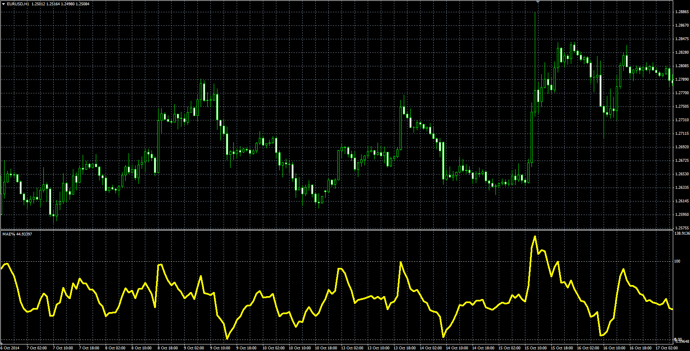

# Moving Average Envelopes Percentage (MAE%)

> Source: https://fxcodebase.com/code/viewtopic.php?f=38&t=61626  
> Forum: 38 · Topic 61626 · 1 post(s)

---

## Moving Average Envelopes Percentage (MAE%)

**Alexander.Gettinger** · Mon Dec 22, 2014 10:26 am

Original LUA oscillator: [viewtopic.php?f=17&t=2997](https://fxcodebase.com/code/viewtopic.php?f=17&t=2997).

Formula:
MAE[i] = 100*(Price[i]-dn)/(up-dn), where
up = MA*(1+Offset/1000),
dn = MA*(1-Offset/1000),
MA - MVA(Price) with [Length] number of periods.

 

Download:

 [MAE.mq4](files/97832/MAE.mq4)
