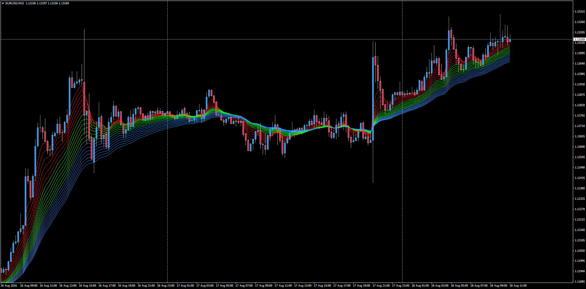

# Moving Average Fan with Alerts for MT4

> Source: https://fxcodebase.com/code/viewtopic.php?f=38&t=63780  
> Forum: 38 · Topic 63780 · 1 post(s)

---

## Moving Average Fan with Alerts for MT4

**Apprentice** · Thu Aug 18, 2016 4:27 am

Based on lua.
[viewtopic.php?f=17&t=1102](https://fxcodebase.com/code/viewtopic.php?f=17&t=1102)

Alert Description: Optional Alert when the indicator indentifies a cross of one of the moving averages in the fan.

Example
It will alert "EURUSD (TF): Fan Up Cross"

 [Fan_MA.mq4](files/107684/Fan_MA.mq4)
