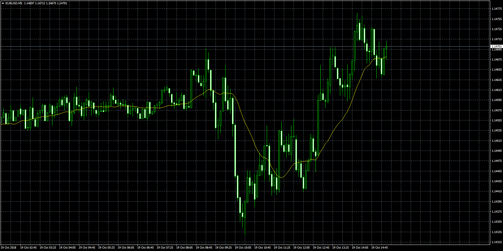

# Moving Average Indicator: 20 in 1

> Source: https://fxcodebase.com/code/viewtopic.php?f=38&t=66845  
> Forum: 38 · Topic 66845 · 1 post(s)

---

## Moving Average Indicator: 20 in 1

**Apprentice** · Fri Oct 19, 2018 9:17 am

Based on TS2/Lua version.
[viewtopic.php?f=17&t=2430](https://fxcodebase.com/code/viewtopic.php?f=17&t=2430)
This indicator is a collection of moving averages.

1.	MVA - Simple Moving Average
MVA[i]=(Price[i]+Price[i-1]+…+Price[i-N])/N, where N-period

2.	EMA - Exponential Moving Average
EMA[i]=EMA[i-1]+2*(Price[i]-EMA[i-1])/(1+N)

3.	Wilder - Wilder Exponential Moving Average
Wilder[i]=Wilder[i-1]+(Price[i]-Wilder[i-1])/N

4.	LWMA - Linear Weighted Moving Average
LWMA[i]=Sum/Weight, where
Sum=Price[i]*N+Price[i-1]*(N-1)+…+Price[i-N+1]*(1),
Weight=N+(N-1)+…+1=N*(N+1)/2.

5.	SineWMA - Sine Weighted Moving Average
SineWMA[i]=Sum/Weight, where
Sum=Price[i-N+1]*sin(PI*(N)/(N+1))+Price[i-N+2]*sin(PI*(N-1)/(N+1))+…+Price[i]*sin(PI*1/(N+1))
Weight= sin(PI*(N)/(N+1))+ sin(PI*(N-1)/(N+1))+…+ sin(PI*1/(N+1)).

6.	TriMA - Triangular Moving Average
TriMA[i]=(MVA(i,len)+MVA(i-1,len)+…+MVA(i-len+1,len))/len, where
MVA(i,N) – Simple Moving Average,
len=(N+1)/2.

7.	LSMA - Least Square Moving Average
LSMA[i]=Sum/(N*(N+1)), where
Sum=(1-(N+1)/3)*Price[i-N+1]+(2-(N+1)/3)*Price[i-N+2]+…+(N-(N+1)/3)*Price[1].

8.	SMMA - Smoothed Moving Average
SMMA[i]=(Sum-SMMA[i-1]+Price[i])/N, where
Sum=Price[i-1]+Price[i-2]+…+Price[i-N].

9.	HMA - Hull Moving Average by Alan Hull
HMA[i]=LWMA(i,len,(2*LWMA(i,N/2,Price)-LWMA(i,N,Price))), where
len=Sqrt(N),
LWMA(i,N,Price) - Linear Weighted Moving Average

10.	ZeroLagEMA - Zero-Lag Exponential Moving Average
ZeroLagEMA[i]=Alpha*(2*Price[i]-Price[i-lag])+(1-Alpha)* ZeroLagEMA[i-1], where
Alpha=2/(N+1),
Lag=(N-1)/2.

11.	DEMA - Double Exponential Moving Average by Patrick Mulloy
DEMA[i]=2*D1[i]-D2[i], where
D1[i]=D1[i-1]+2*(Price[i]-D1[i-1])/(1+N),
D2[i]=D2[i-1]+2*(D1[i]-D2[i-1])/(1+N).

12.	T3 - T3 by T.Tillson
T3[i]=DEMA(i,DEMA2), where
DEMA2[i]=DEMA(i,DEMA1),
DEMA1[i]=DEMA(i,Price),
DEMA - Double Exponential Moving Average

13.	ITrend - Instantaneous Trendline by J.Ehlers
ITrend[i]=(Price[i]+2*Price[i-1]+Price[i-2])/4 for i<=7,
ITrend[i]=(Alpha-0.25*Alpha*Alpha)*Price[i]+0.5*Alpha*Alpha*Price[i-1]-(Alpha-0.75*Alpha*Alpha)*Price[i-2]+2*(1-Alpha)*ITrend[i-1]-(1-Alpha)*(1-Alpha)*ITrend[i-2] for i>7, where
Alpha=2/(N+1)

14.	Median - Moving Median
Set of the prices (Price[i], Price[i-1], …, Price[i-N]) is sorted (on increase or decrease) and take value from of the set (N/2).

15. GeoMean - Geometric Mean
GeoMean[i]=Price[i]^(1/N)*Price[i-1]^(1/N)*…*Price[i-N+1]^(1/N).

16.	REMA - Regularized EMA by Chris Satchwell
REMA[i]=(REMA[i-1]*(1+2*Lambda)+Alpha*(Price[i]-REMA[i-1])-Lambda*REMA[i-2])/(1+Lambda), where
Alpha=2/(N+1),
Lambda=0.5.

17.	ILRS - Integral of Linear Regression Slope
ILRS[i]=(N*Sum1-Sum*Sumy)/(Sum*Sum-N*Sum2)+MVA(I,N), where
Sum=N*(N-1)*0.5,
Sum2=N*(N-1)*(2*N-1)/6,
Sum1=1*Price[i-1]+2*Price[i-2]+…+(N-1)*Price[i-N+1],
Sumy=Price[i]+Price[i-1]+…+Price[i-N+1],
MVA(i,N) – Simple Moving Average.

18.	IE/2 - Combination of LSMA and ILRS
IE/2=(ILRS+LSMA)/2

19.	TriMAgen - Triangular Moving Average generalized by J.Ehlers
TriMAgen[i]=Sum/(len+1), where
Sum=MVA(i,len)+MVA(i-1,len)+…+MVA(i-len,len), where
MVA(i,N) – Simple Moving Average,
len=(N+1)/2.

20.	JSmooth - Smoothing by Mark Jurik
JSmooth[i]=J5[i], where
J5[i]=J5[i-1]+J4[i],
J4[i]=(J3[i]-J5[i-1])*(1-Alpha)*(1-Alpha)+J4[i-1]*Alpha*Alpha,
J3[i]=J1[i]+J2[i],
J2[i]=(Price[i]-J1[i])*(1-Alpha)+J2[i-1]*Alpha,
J1[i]=Price[i]*(1-Alpha)+J1[i-1]*Alpha,
Alpha=0.45*N/(0.45*(N-1)+2).

 [averages.mq4](files/121670/averages.mq4)
