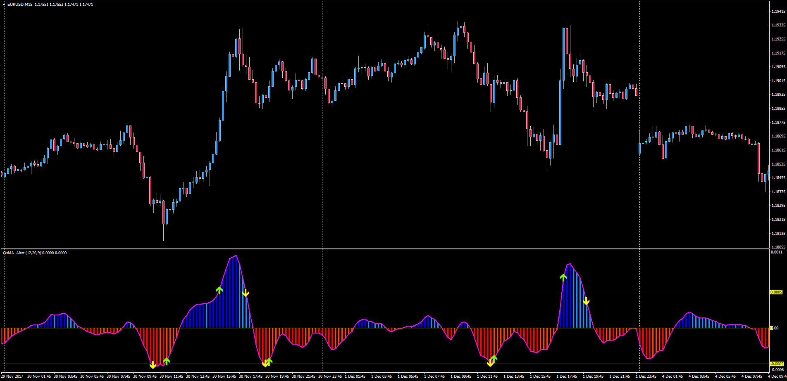
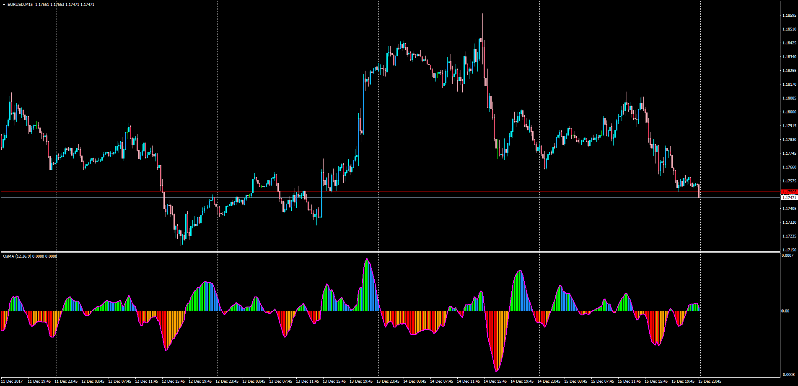

# Moving Average of Oscillator wit Level Alert

> Source: https://fxcodebase.com/code/viewtopic.php?f=38&t=65456  
> Forum: 38 · Topic 65456 · 2 post(s)

---

## Moving Average of Oscillator wit Level Alert

**Apprentice** · Sun Dec 17, 2017 6:11 am

Description:

This indicator will alert (sound and/or email) whenever the moving average of oscillator is above a user defined level, when entering and leaving an overbought or oversold level.

LUA Original: [viewtopic.php?f=17&t=64284](https://fxcodebase.com/code/viewtopic.php?f=17&t=64284)

 [OsMA_Alert.mq4](files/116504/OsMA_Alert.mq4)

---

## Moving Average of Oscillator (OsMA)

**Apprentice** · Sun Dec 17, 2017 6:14 am

LUA Original: [viewtopic.php?f=17&t=1856](https://fxcodebase.com/code/viewtopic.php?f=17&t=1856)

Description:

This indicator is a MT4 representation of the LUA Original "Moving Average of Oscillator" which is basically a histogram with the difference between the MACD and its signal line. It comes with increasing and decreasing colors both above and below the zero line.

 [OsMA.mq4](files/116505/OsMA.mq4)
