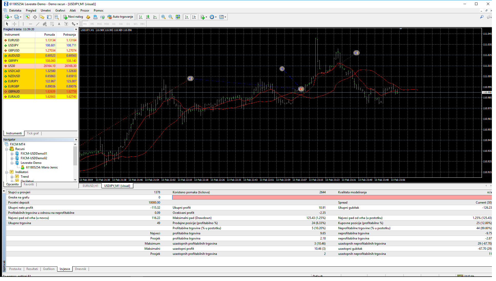

# MOVING AVERAGE PARABOLIC SAR EA

> Source: https://fxcodebase.com/code/viewtopic.php?f=38&t=68558  
> Forum: 38 · Topic 68558 · 5 post(s)

---

## MOVING AVERAGE PARABOLIC SAR EA

**Apprentice** · Tue Jun 11, 2019 5:34 am

Based on request.
[viewtopic.php?f=27&t=68547](https://fxcodebase.com/code/viewtopic.php?f=27&t=68547)

 [MOVING AVERAGE PARABOLIC SAR EA.mq4](files/126831/MOVING%20AVERAGE%20PARABOLIC%20SAR%20EA.mq4)

---

## Re: MOVING AVERAGE PARABOLIC SAR EA

**dp1969** · Sun Jun 16, 2019 12:36 pm

Thanks. I'll be back testing this code and communicate progress.

---

## Re: MOVING AVERAGE PARABOLIC SAR EA

**JaxPacific** · Tue Jun 25, 2019 3:17 am

results?

---

## Re: MOVING AVERAGE PARABOLIC SAR EA

**vsaddi** · Wed Jul 17, 2019 11:58 am

Please see the report I attached

I would like to understand your parameters. Can you please explain each one of them?

Thanks

Vitoria

---

## Re: MOVING AVERAGE PARABOLIC SAR EA

**Apprentice** · Mon Jul 22, 2019 6:08 am

Parameters used in this template
Trade live?
Whether to check entry rules every tick (Live) or on bar close. Live mode gives more false signals but takes an action more quickly.

Position size
Position size. The unit is defined by the Position size type parameter

Position size type
Unit for the Position size parameter.

$. Position size defined in the amount of currency to be spend on the lot using the current leverage;
In contracts. Absolute number of contracts;
% of equity. $ of equity to be spend on the lot using the current leverage;
Risk in % of equity. Maximum affordable loss in % of equity. Calculated using the stop loss and the currect equity. After the stop loss hit you will lose around the specified % of equity.
Slippage, points
Used slippage in points.

What trades should be taken
This parameter allows to limit trading to long/short only.

Logic type
This parameter allows to inverse the trading logic.

Close on opposite signal
Whether to close long trades on short signal/short on long signal.

Position Cap
Allows to limit number of trades opened at one point of time.

Max # of buy+sell positions
General limit for buy+sell positions. Used to limit number of total positions.

Max # of buy positions
General limit for buy positions.

Max # of sell positions
General limit for sell positions.

Stop loss type
Stop loss type.

Do not use. No stop loss;
Set in %. Defined in % from the entry price;
Set in Pips. Defined in pips;
Set in $. Defined in currency. When the stop loss will be hit you will loss around that amount of money.
Set in % of stop loss. Not used for a stop loss;
Set in absolite value (rate). Absolute rate defined by the user.
Stop loss value
Stop loss. The unit is defined by the Stop loss type parameter.

Trailing type
Stop loss trailing type.

No trailing. Disabled;
Use trailing in pips. The stop loss will be moved to the specified number of pips after the same amount of price movement;
Use trailing in % of stop. The stop loss will be moved to the specified number of % after the same amount of price movement.
Trailing step
Trailing step. The unit defined by the Trailing type parameter.

Min distance to order to activate the trailing
Distance to trigger the trailing. When set to 0 the trailing will start immideatly. This parameter allows to start trailing only in profit (when set to > 0).

Trigger type for the breakeven
Breakeven moves stop once after certain amount of profit is hit. This parameter defines breakeven type. Parameters are the same as for the Stop loss type parameter.

Trigger for the breakeven
When to trigger the stop loss move.

Breakeven target
Target level in pips for the stop loss after the breakeven level is hit.

Take profit type
Take profit type.

Do not use. No take profit;
Set in %. Defined in % from the entry price;
Set in Pips. Defined in pips;
Set in $. Defined in currency. When the take profit will be hit you will gain around that amount of money.
Set in % of stop loss. Ration to the stop loss. Use 1 to use 1:1 take profit:stop loss. When 2 is used the take profit will be twice as far as the stop loss, etc.;
Set in absolite value (rate). Absolute rate defined by the user.
Take profit value
Take profit value. The unit will be defined by the Take profit type parameter.

Magic number
Magic number of orders

Start time in hhmmss format and Stop time in hhmmss format
Start of the trading time and stop of the trading time. hhmmss format is used. Use the same value to all-day trading.

Weekly time
Whether to limit trading based on day of the week.

Start day
Start day for the trading

Start time in hhmmss format
Start time for the trading.

Stop day
Stop day for the trading.

Stop time in hhmmss format
Stop time for the trading.

Mandatory closing for non-trading time
When set to true all positions and orders will be deleted/closed when trading hours will end.
