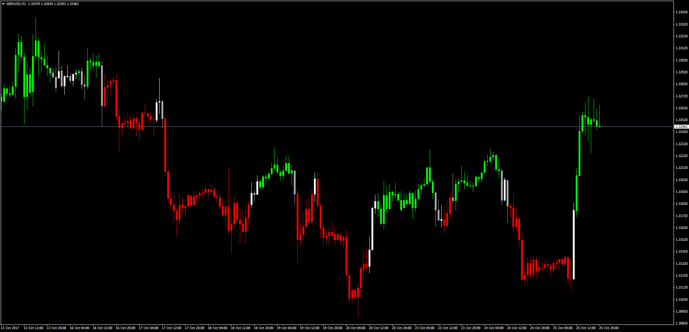
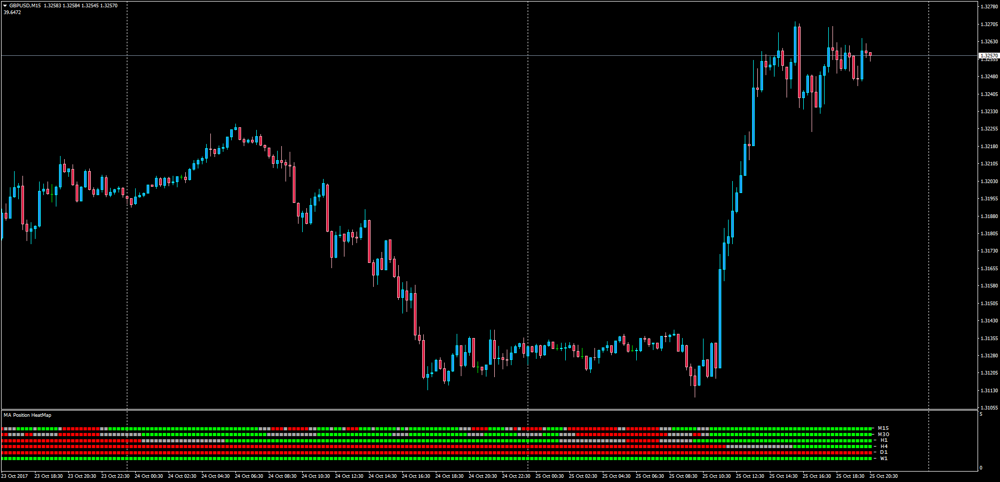

# Moving Average Position Overlay

> Source: https://fxcodebase.com/code/viewtopic.php?f=38&t=65205  
> Forum: 38 · Topic 65205 · 1 post(s)

---

## Moving Average Position Overlay

**Apprentice** · Thu Oct 26, 2017 3:24 am

LUA Original: [viewtopic.php?f=17&t=61569](https://fxcodebase.com/code/viewtopic.php?f=17&t=61569)

 

Description:

In this variation of the MA Position, the candles in the current chart will be colored according to the following conditions:

Green: MA1 > MA 2 and MA2 > MA3
Red: MA1 < MA2 and MA2 < MA3

 [MA_Position_Overlay.mq4](files/115611/MA_Position_Overlay.mq4)

Description:

This is the MT4 version of the LUA Original heatmap showing green or red when the following conditions take place:

Green: MA1> MA2 and MA2> MA3
Red: MA1< MA2 and MA2< MA3

 [MA_Position_HeatMap.mq4](files/115611/MA_Position_HeatMap.mq4)
