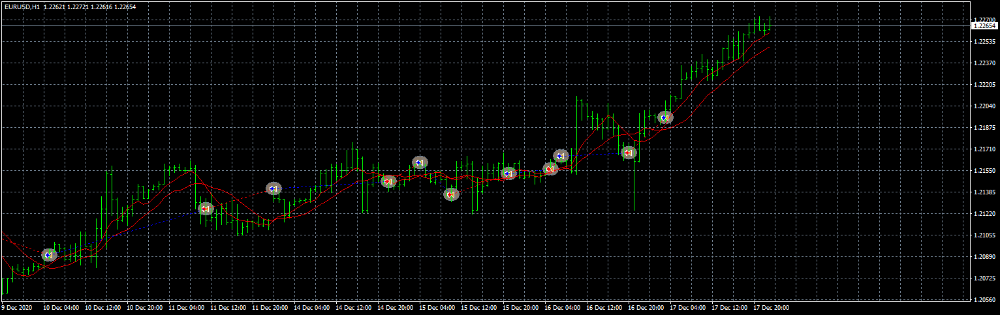

# Moving_Average_Slow_Stochastic_

> Source: https://fxcodebase.com/code/viewtopic.php?f=38&t=71142  
> Forum: 38 · Topic 71142 · 1 post(s)

---

## Moving_Average_Slow_Stochastic_

**Apprentice** · Mon Apr 26, 2021 2:52 am

Based on the request.
[https://fxcodebase.com/code/viewtopic.php?f=27&t=71141](https://fxcodebase.com/code/viewtopic.php?f=27&t=71141)

 [Moving_Average_Slow_Stochastic_susan61_EA.mq4](files/141734/Moving_Average_Slow_Stochastic_susan61_EA.mq4)

 [Keltner_Band_MA_EA.mq4](files/141734/Keltner_Band_MA_EA.mq4)
