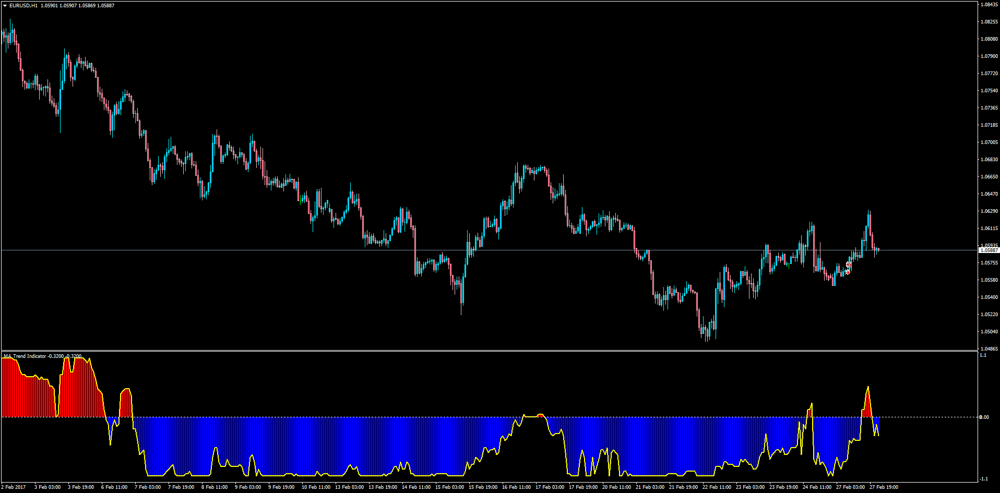

# Moving Average Trend Indicator

> Source: https://fxcodebase.com/code/viewtopic.php?f=38&t=64492  
> Forum: 38 · Topic 64492 · 1 post(s)

---

## Moving Average Trend Indicator

**Apprentice** · Tue Feb 28, 2017 3:46 am

LUA Original: [viewtopic.php?f=17&t=3481](https://fxcodebase.com/code/viewtopic.php?f=17&t=3481)

Description:

The original LUA concept is quite interesting. If the trader wants to analyze the typical position of price (above or below) relative to a moving average, this indicator does that, but in a statistical way: It compares 50 different MA-Periods according to the Start_Period and the Steps (difference between each of those periods) and makes a final Sum of +1 and -1 depending whether price is above or below. This way, the trader knows when a trend is weakening and a new trend is under construction going from positive to negative and vice versa.

Indicator analyses [Count_MA] moving averages with first period [Start_Period] and step [Step_Period].

MA_Trend=Sum(S)/Count_MA, where:

S(i)=1 if Price>MA(i) and S(i)=-1 if Price<MA(i).

 [MA_Trend_Indicator.mq4](files/111236/MA_Trend_Indicator.mq4)
