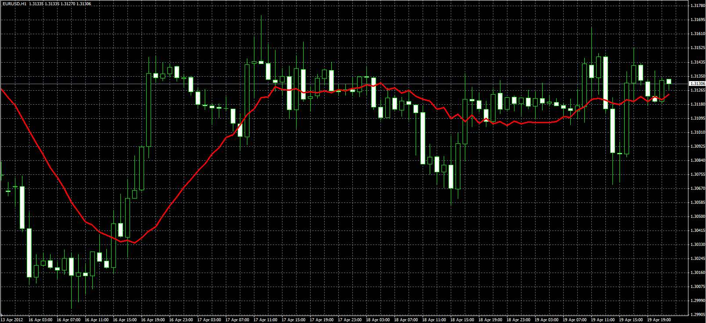

# Moving average with step

> Source: https://fxcodebase.com/code/viewtopic.php?f=38&t=16427  
> Forum: 38 · Topic 16427 · 3 post(s)

---

## Moving average with step

**Alexander.Gettinger** · Thu Apr 19, 2012 2:21 pm

Original indicator: [viewtopic.php?f=17&t=14876&p=28173](https://fxcodebase.com/code/viewtopic.php?f=17&t=14876&p=28173)

> This indicator is very similar to MVA, but it does not use all the values ​​for the calculation.
>
> Formula:
> MVA_S[i]=(Price[i]+Price[i-Step]+Price[i-2*Step]+...+Price[i-(Period-1)*Step])/Period.
>
> For example, if Period=4 and Step=2:
> MVA_S[i]=(Price[i]+Price[i-2]+Price[i-4]+Price[i-6])/4.

 

Download:

 [MVA_S.mq4](files/30539/MVA_S.mq4)

---

## GBP/USD buy only MT4 EA

**[email protected]** · Sun Apr 22, 2012 7:42 pm

Strategy Tester Report
EA_GBP_USD_BUYONLY
InstaForex-Singapore.com (Build 419)

Symbol	GBPUSD (Great Britain Pound vs US Dollar)
Period	1 Hour (H1) 2011.12.16 14:00 - 2012.04.19 23:59 (2011.12.01 - 2012.04.20)
Model	Open prices only (only for Expert Advisors that explicitly control bar opening)
Parameters	BuyLots12=0.05; BuyStoploss12=0; BuyTakeprofit12=10; MaxBuyLots12=10; LotsBuyChOnLoss12=0; LotsBuyChOnProfit12=0; LotsBuyMpOnLoss12=1; LotsBuyMpOnProfit12=1; LotsResetOnProfit12=false; LotsResetOnLoss12=false;
Bars in test	2236	Ticks modelled	4370	Modelling quality	n/a
Mismatched charts errors	0
Initial deposit	100.00
Total net profit	513.23	Gross profit	515.08	Gross loss	-1.85
Profit factor	278.42	Expected payoff	0.50
Absolute drawdown	96.21	Maximal drawdown	192.55 (47.09%)	Relative drawdown	97.68% (160.00)
Total trades	1033	Short positions (won %)	0 (0.00%)	Long positions (won %)	1033 (99.61%)
Profit trades (% of total)	1029 (99.61%)	Loss trades (% of total)	4 (0.39%)
Largest	profit trade	0.52	loss trade	-0.55
Average	profit trade	0.50	loss trade	-0.46
Maximum	consecutive wins (profit in money)	1029 (515.08)	consecutive losses (loss in money)	4 (-1.85)
Maximal	consecutive profit (count of wins)	515.08 (1029)	consecutive loss (count of losses)	-1.85 (4)
Average	consecutive wins	1029	consecutive losses	4

---

## Re: Moving average with step

**Apprentice** · Fri Jan 20, 2017 4:58 am

Indicator was revised and updated.
