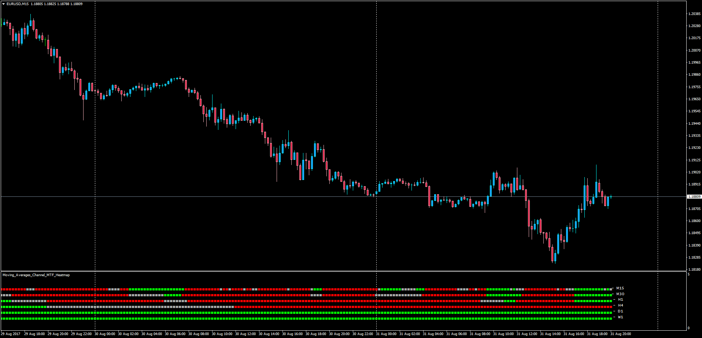

# Moving Averages Channel MTF Heatmap

> Source: https://fxcodebase.com/code/viewtopic.php?f=38&t=65045  
> Forum: 38 · Topic 65045 · 1 post(s)

---

## Moving Averages Channel MTF Heatmap

**Apprentice** · Thu Aug 31, 2017 3:33 pm

LUA Original: [viewtopic.php?f=17&t=60541](https://fxcodebase.com/code/viewtopic.php?f=17&t=60541)

Description:

This is the MT4 version of the LUA original - Moving Averages Channel Indications are determined by the position of the closing price in relation to channel, generated by two moving averages.

Positive indication – Closing Price is above the channel (Both Slow and Fast MA's)
Negativ indication – Closing Price is below the channel
Neutal indication – Closing Price is within the channel

 [Moving_Averages_Channel_MTF_Heatmap.mq4](files/114587/Moving_Averages_Channel_MTF_Heatmap.mq4)
