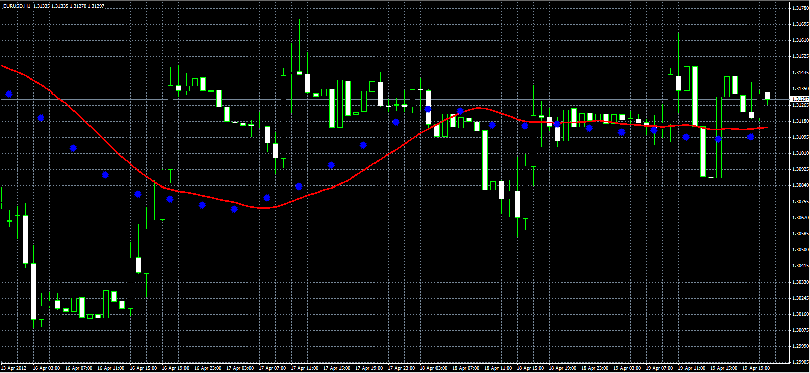

# Moving averages with different timeframes

> Source: https://fxcodebase.com/code/viewtopic.php?f=38&t=16421  
> Forum: 38 · Topic 16421 · 2 post(s)

---

## Moving averages with different timeframes

**Alexander.Gettinger** · Thu Apr 19, 2012 2:17 pm

Original indicator: [viewtopic.php?f=17&t=15881](https://fxcodebase.com/code/viewtopic.php?f=17&t=15881)

> Indicator draws the MA with a specified period for the selected timeframe (dots) and MA with equivalent period on current timeframe (line).

 

Download:

 [Diff_TF_MA.mq4](files/30532/Diff_TF_MA.mq4)

---

## Re: Moving averages with different timeframes

**Alexander.Gettinger** · Fri Jun 01, 2012 2:02 pm

Strategy based on this indicator: [viewtopic.php?f=38&t=19650](https://fxcodebase.com/code/viewtopic.php?f=38&t=19650)
