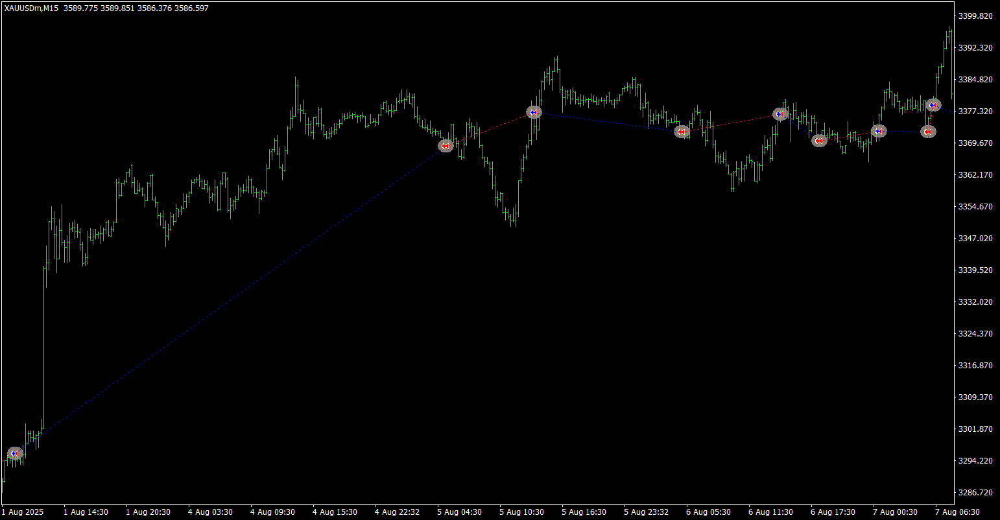

# MQLTA_MA_Multi-Timeframe_EA

> Source: https://fxcodebase.com/code/viewtopic.php?f=38&t=76300  
> Forum: 38 · Topic 76300 · 5 post(s)

---

## MQLTA_MA_Multi-Timeframe_EA

**Apprentice** · Tue Sep 09, 2025 3:22 am

Based on the request.
[https://fxcodebase.com/code/viewtopic.php?f=38&t=76286](https://fxcodebase.com/code/viewtopic.php?f=38&t=76286)

 [MQLTA_MA_Multi-Timeframe_EA.mq4](files/160499/MQLTA_MA_Multi-Timeframe_EA.mq4)

---

## Re: MQLTA_MA_Multi-Timeframe_EA

**dilong** · Tue Sep 30, 2025 7:12 am

> **Apprentice wrote:**
>
>
> 567.png
>
>
> Based on the request.
> [https://fxcodebase.com/code/viewtopic.php?f=38&t=76286](https://fxcodebase.com/code/viewtopic.php?f=38&t=76286)
>
>
> MQLTA_MA_Multi-Timeframe_EA.mq4

Hello Apprentice, please make it for MT5.
Thank you sir.

---

## Re: MQLTA_MA_Multi-Timeframe_EA

**Apprentice** · Wed Oct 01, 2025 6:03 am

We have added your request to the development list.
Development reference 607

---

## Re: MQLTA_MA_Multi-Timeframe_EA

**Apprentice** · Mon Oct 06, 2025 4:28 am

 [MQLTA_MA_Multi-Timeframe_EA.ex5](files/160785/MQLTA_MA_Multi-Timeframe_EA.ex5)

---

## Re: MQLTA_MA_Multi-Timeframe_EA

**dilong** · Mon Oct 06, 2025 10:31 pm

> **Apprentice wrote:**
>
>
> Snimka zaslona 2025-10-06 112753.png
>
>
>
>
> MQLTA_MA_Multi-Timeframe_EA.ex5

Thank you sir Apprentice.
