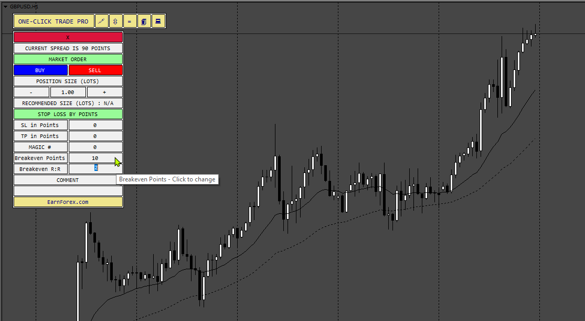
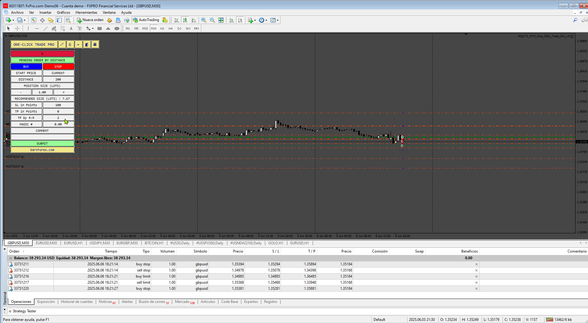

# MQLTA_MT4_One_Click_Trade_Pro_v3

> Source: https://fxcodebase.com/code/viewtopic.php?f=38&t=75972  
> Forum: 38 · Topic 75972 · 4 post(s)

---

## MQLTA_MT4_One_Click_Trade_Pro_v3

**Apprentice** · Sat May 24, 2025 2:03 pm

Based on the request.
[https://fxcodebase.com/code/viewtopic.p ... 22#p159122](https://fxcodebase.com/code/viewtopic.php?f=27&p=159122#p159122)

 [MQLTA_MT4_One_Click_Trade_Pro_v3.mq4](files/159346/MQLTA_MT4_One_Click_Trade_Pro_v3.mq4)

---

## Re: MQLTA_MT4_One_Click_Trade_Pro_v3

**Chibyx** · Sun Jun 01, 2025 2:53 pm

Thank you very much Sir,

I have tried this, I see the options but when I use it the panel and platform seems to freeze and I am unable to see the SL and TP lines. Can this be resolved please and in addition to breakeven by RR, option for TP setting by RR can also be added, thank you very much.

---

## Re: MQLTA_MT4_One_Click_Trade_Pro_v3

**Apprentice** · Thu Jun 05, 2025 5:20 am

We have added your request to the development list.
Development reference 375

---

## Re: MQLTA_MT4_One_Click_Trade_Pro_v3

**Apprentice** · Sat Jun 07, 2025 9:00 am

 [MQLTA_MT4_One_Click_Trade_Pro_v4.mq4](files/159530/MQLTA_MT4_One_Click_Trade_Pro_v4.mq4)
