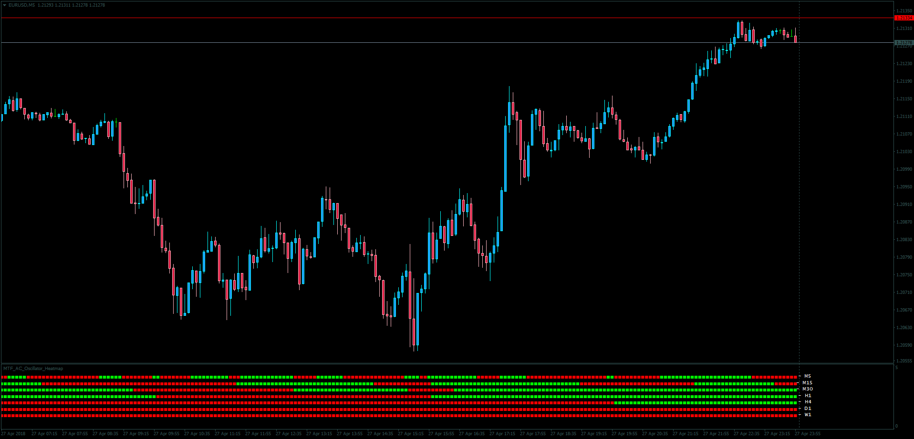

# MTF Acceleration/Deceleration Oscillator Heatmap

> Source: https://fxcodebase.com/code/viewtopic.php?f=38&t=65977  
> Forum: 38 · Topic 65977 · 1 post(s)

---

## MTF Acceleration/Deceleration Oscillator Heatmap

**Apprentice** · Tue May 01, 2018 6:09 am

LUA Original: [viewtopic.php?f=17&t=2126](https://fxcodebase.com/code/viewtopic.php?f=17&t=2126)

Description:

MT4 version of the LUA Original showing the Bill Williams AC indicator within all the timeframes of one currency pair. It comes in two modes: above/below the zero line, and slope.

 [MTF_AC_Oscillator_Heatmap.mq4](files/118901/MTF_AC_Oscillator_Heatmap.mq4)
