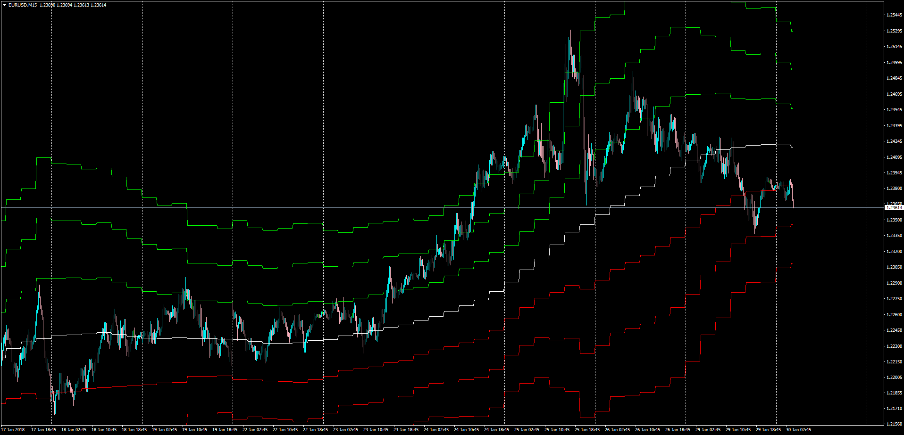

# MTF ATR Channel

> Source: https://fxcodebase.com/code/viewtopic.php?f=38&t=65681  
> Forum: 38 · Topic 65681 · 1 post(s)

---

## MTF ATR Channel

**Apprentice** · Tue Jan 30, 2018 11:26 am

LUA Original: [viewtopic.php?f=17&t=858](https://fxcodebase.com/code/viewtopic.php?f=17&t=858)

Description:

The formula of the original LUA indicator goes like this:

ATRC = Close +- Multiplier*ATR*Channel percentage

This MT4 version is made with the MTF functionality. Also the Close has been substituted by a Moving Average that can be choosen within any of 17 different types.

 [MTF_ATR_Channel.mq4](files/117353/MTF_ATR_Channel.mq4)
